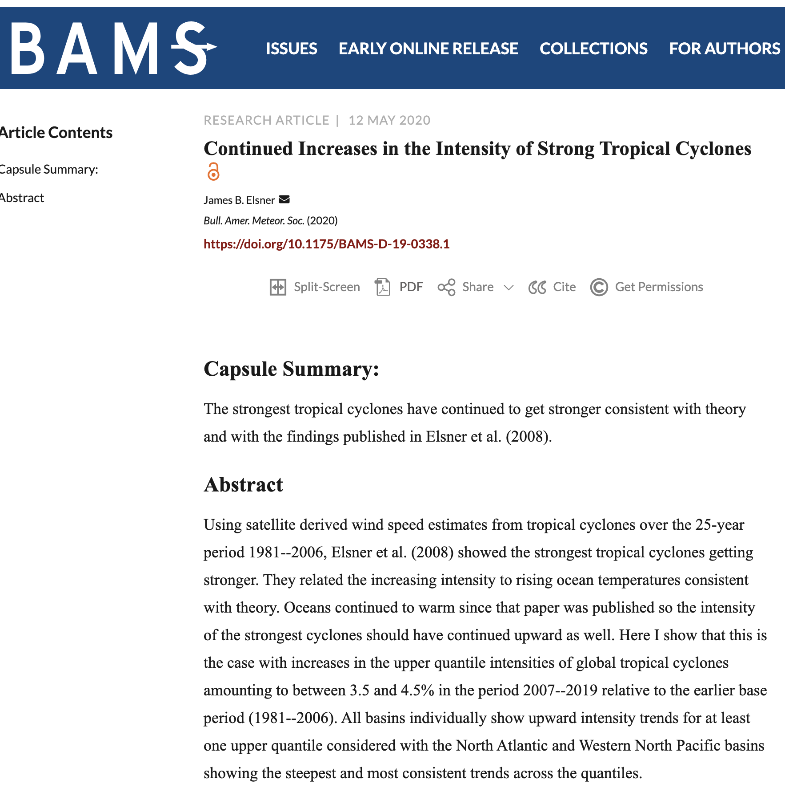

# {-}

```{r, echo=FALSE}
DiagrammeR::grViz("digraph rmarkdown {

D [shape = square]
A [shape = square]
L [shape = circle]
H [shape = circle]
W [shape = circle, color = orange]

{D A L H} -> W

}
", height = 250)
```

<!--chapter:end:index.Rmd-->

# Syllabus {-}

## GEO5165C: Quantitative Geography {-}

## Contact information {-}

* Instructor Name: Professor James B. Elsner (he/him/his)
* Instructor Location: Bellamy Building, Room 323a
* Lesson Hours: TR 3:05-4:20 p.m.
* Student Hours: TR 9-10 a.m., 2-3 p.m.

Email: <jelsner@fsu.edu>

## Course description {-}

This course is an introduction to the quantitative analysis of geographic data (data analysis for geographers). Most of the course content will be available through Canvas and through RStudio Cloud. Please open an account with RStudio Cloud at (https://rstudio.cloud). 

Please use this link https://rstudio.cloud/spaces/12733/join?access_code=NuhGFcK71GlGuzoKzAUIe1lqgcMDyOIC7UnnFtNG to join the Spatial Data Analysis workspace on RStudio Cloud.

## Expected learning outcomes {-}

You will describe and demonstrate the principles of data science. You will do this with a grammar for manipulating data and a grammar for making graphs. The grammars are implemented in R using the syntax of tidyverse.

## Materials {-}

* You will need access to the internet and either an iPad, laptop, or desktop computer. 
* All course materials are available through RStudio Cloud (https://rstudio.cloud/spaces/12733/projects) and archived on Canvas.
* There is no required textbook. 
* Much of the material for the course comes from the online book: R for Data Science https://r4ds.had.co.nz/
* Additional help is available online (e.g., https://tinystats.github.io/teacups-giraffes-and-statistics/index.html)

## Class meetings {-}

- Online: synchronous, interactive, asynchronous recordings available on Canvas
- Some lectures, lots of learn-by-doing

## Grades {-}

* Grades are determined solely by how well you do on the regularly scheduled homework/classwork assignments. 
* There are NO quizzes, tests, or exams. 
* Synchronous attendance is expected but not required. 
* Late classwork or homework assignments will not be accepted.
* Cumulative numerical averages of 90 - 100 (outstanding) are guaranteed at least an A-, 80 - 89 (good) at least a B-, and 70 - 79 (satisfactory) at least a C-, however the exact ranges for letter grades will be determined after all work is complete.

## Academic honor code {-}

http://www.eng.fsu.edu/~peterson/fsuhc.html

## Students With Disabilities Act {-}

Students needing academic accommodation should: (1) register with and provide documentation to the Student Disability Resource Center (https://dos.fsu.edu/sdrc/); (2) bring a letter to me indicating the need for accommodation and what type. This should be done sometime during the first week of classes.

## Inclusiveness {-}

It is my intent to present materials and activities that are respectful of diversity: gender identity, sexuality, disability, age, socioeconomic status, ethnicity, race, nationality, religion, and culture. Let me know ways to improve the effectiveness of the course for you personally, or for other students or student groups.

- If you have a name and/or set of pronouns that differ from those that appear in your official FSU records, please let me know.
- If you feel your performance is being impacted by your experiences outside of class, please don't hesitate to come and talk with me. If you prefer to speak with someone outside of the course, your academic dean is an excellent resource. 
- If something was said in class (by anyone) that made you feel uncomfortable, please talk to me about it.

## More about your instructor {-}

* [Canvas](https://cas.fsu.edu/cas/login)
* [GitHub](https://github.com/jelsner/)
* [Twitter](https://twitter.com/JBElsner)
* [Research Website](http://myweb.fsu.edu/jelsner/_site/)

## Syllabus change policy {-}

This syllabus is a guide for the course and is subject to change with advanced notice.

## Schedule (subject to change with notice) {-}

Week | Dates                       | Topic
-----|-----------------------------|-------
1    | August 24, 26, 28           | RStudio Cloud and R
2    | August 31, September 2, 4   | Working with R
3    | September 9, 11             | Data and data frames
4    | September 14, 16, 18        | Data analysis
5    | September 21, 23, 25        | Graphical analysis
6    | September 28, 30, October 1 | Mapping
7    | October 5, 7, 9             | Bayesian data analysis
8    | October 12, 14, 16          | Regression
9    | October 19, 21, 23          | Multiple regression
10   | October 26, 28, 30          | Regression trees
11   | November 2, 4, 6            | Spatial data
12   | November 9, 13              | Spatial autocorrelation
13   | November 16, 18, 19         | Spatial autocorrelation
14   | November 30, December 2, 3  | Geographic regression

I will cover new material on Mondays and Wednesdays. On Fridays you will work on your assignment. Assignments are due Fridays at 5p.

Assignment | Due Date (no later than 5 pm)
-----------|---------------
1          | August 28
2          | September 4
3          | September 11
4          | September 25
5          | October 1
6          | October 9
7          | October 16
8          | October 23
9          | October 30
10         | November 19
11         | December 3

## Other materials to check out {-}

* [Best practices for working with R](https://twitter.com/DanOvand0/status/1309223236740083712)
Develop a project-oriented work flow and don't use `setwd()`. Don't hard-coded file path names. Use version control (github). Manage package dependencies. Pick a style of writing code and stick with it. Do as much as you can in RMarkdown (notes, lectures, slides, etc). Check out [Openscapes](https://www.openscapes.org/).

* [Reading R](https://kieranhealy.org/blog/archives/2020/09/24/us-excess-mortality/)

* Towards a more open and reproducible approach to geographic and spatial data science [Opening practice: supporting reproducibility and critical spatial data science](https://link.springer.com/article/10.1007/s10109-020-00334-2)


## Julia programming language {-}

Julia programming language https://julialang.org/
Download > Open

Jupyter Notebook
(1) Anaconda > Individual > Download > Install
(2) In the Julia REPL type:
using Pkg
Pkg.add("IJulia")
(3) Then click on the Anaconda-Navigator icon and Launch Jupyter Notebook
(4) Click on the New button and select Julia.
Problems? watch https://www.youtube.com/watch?v=oyx8M1yoboY

Pluto Notebook
In the Julia REPL type:
import Pkg; Pkg.add("Pluto")
import Pluto
Pluto.run()

md"""
# This Pluto notebook is a test.
"""
begin
a = [1, 4, 7, 22]
	a * 10
end


<!--chapter:end:00-Syllabus.Rmd-->

# Tuesday, August 23, 2022 {-}

- Is it getting hotter here in Tallahassee?
- Are Atlantic hurricanes getting stronger?

Data science (formerly known as 'statistics') is an exciting discipline that allows you to turn data into understanding, insight, and knowledge.

## Today {-}

- Understand what this course is about, how it is structured, and my expectations for you
- Start working with RStudio and R.

## What is this course? {-}

This is designed as first course in data science for geographers.

**Q - What statistics background does this course assume?**  
A - None.

**Q - Is this an intro stat course?**  
A - Statistics and data science are closely related with much overlap. Hence, this course is a great way to get started with statistics. But this course is **not** your typical high school/college statistics course.

**Q - Will you be doing computing?**   
A - Yes.

**Q - Is this an introduction to computer science course?**  
A - No, but many themes are shared.

**Q - What computing language will you learn?**  
A - R.

**Q - Why not language some other language?**  
A - We can discuss that over coffee.

## Where are the materials for this course? {-}

[Github](https://github.com/jelsner/QG-2022)

[RStudio Cloud](https://rstudio.cloud)

## Join RStudio Cloud {-}

* Go to [RStudio Cloud](https://rstudio.cloud), and log in.
* Click on this link https://rstudio.cloud/spaces/75344/join?access_code=drxxMUzCFzMd2hUzGi5EZZaR9CgXY2jJVC6mz54L to join the Quantitative Geography Using R Space on RStudio Cloud.

## Examples {-}

Some of my recent research:

- [More hots](https://eartharxiv.org/q4y8z/)
- [Stronger tornadoes](https://eartharxiv.org/wpkt9/)

Other research:

- [A year as told by fitbit](http://livefreeordichotomize.com/2017/12/27/a-year-as-told-by-fitbit/) by Nick Strayer
- [R-Ladies global tour](http://www.masalmon.eu/2017/10/06/globalrladiestour/) by Maelle Salmon

## Course Syllabus {-}

- Log on to RStudio Cloud and click on this course's Space (Quantitative Geography Using R).
- Click on the project `00_Syllabus` and launch it.
- Open the `00-Syllabus.Rmd` file (lower-right panel), and then click on the "Knit" button.
- Review

## Tallahassee daily temperatures {-}

- Packages > Install
- In the Packages window, type tidyverse, lubridate, here, ggplot2 then select Install

Get the data into your environment.
```{r, get the data}
TLH.df <- readr::read_csv(file = here::here('data', 'TLH_SOD1892.csv'),
                          show_col_types = FALSE) |>
      dplyr::filter(STATION == 'USW00093805') |>
      dplyr::mutate(Date = as.Date(DATE)) |>
      dplyr::mutate(Year = lubridate::year(Date), 
             Month = lubridate::month(Date), 
             Day = lubridate::day(Date),
             doy = lubridate::yday(Date)) |>
      dplyr::select(Date, Year, Month, Day, doy, TMAX, TMIN, PRCP)
```

package::function  (`::` is called a library specifier).

Or, load the packages into your current environment with the `library()` function in the file above where they are first used.

Create a plot of the frequency of high temperatures.
```{r, create a plot}
library(dplyr)
library(ggplot2)

TLH.df |>
  group_by(TMAX) |>
  summarize(nH = n()) |>
ggplot(mapping = aes(x = TMAX, y = nH)) +
  geom_col(col = 'white', fill = "gray70") +
  labs(title = "Frequency of Daily High Temperatures",
       subtitle = "Tallahassee, FL, USA (1940-2018)",
       x = "Daily High Temperature (°F)",
       y = "Number of Days") +
 scale_x_continuous(breaks = seq(from = 20, to = 110, by = 10)) +
 theme_minimal()
```

<!--chapter:end:01-Lesson.Rmd-->

# Thursday, August 25, 2022 {-}

## Today {-}

- Data science: reproducibility, communication, and automation
- Structure of markdown files
- How to make a simple plot
- Everything you create is an object

* Turn off your camera.
* Any questions about my grading of your assignments?
* Make sure (1) you are watching (or at least listening) to me via Zoom, and (2) you have a copy of `02_Lesson` project and  have the `02-Lesson.Rmd` file open. 
* Follow along in your copy of the lesson as I go line by line through the file on Zoom. 
* Your files background and text might look different. Is it? If so, got to Tools > Global Options > Appearance > Cobalt
* Much of the lesson materials come from online books: https://www.bigbookofr.com/index.html
* Datasets: https://kieranhealy.org/blog/archives/2020/08/25/some-data-packages/

## Data Analysis  {-}

Data analytics are done on a computer. You have two choices: use a spreadsheet or write code. 

A spreadsheet is convenient, but they make the three conditions for a good data analysis _reproducibility_, _communication_, and _automation_ difficult to achieve.

### Reproducibility  {-}

A scientific paper is advertisement for a claim. But the _proof_ is the procedure that was used to obtain the result. 


If your analysis is to be convincing, the trail from the data you started with to the final output must be available to the public. A reproducible trail with a spreadsheet is hard. It is easy to make mistakes (e.g., accidentally sorting just a column rather than the entire table).

A set of instructions written as computer code is the exact procedure. (Open `stronger-hur.Rmd`).

### Communication {-}

Code is a recipe for what you did. It communicates precisely what was done. Communication to others and to your future self.

It's hard to explain to someone precisely what you did when working with a spreadsheet. Click here, then right click here, then choose menu X, etc. The words needed to describe these procedures are not standard. Code is an efficient way to communicate because all important information is given as plain text with no ambiguity.

### Automation {-}

If you've ever made a map using a geographic information system (GIS) you know how hard it is to make another one with a new set of data (even a very similar one). Running code with new data is simple.

Being able to code is an important skill for nearly all technical jobs. Here you will learn how to code. But keep in mind: Just like learning to write doesn't mean you will be a writer (i.e., make a living writing), learning to code doesn't mean you will be a coder.

## The R programming language  {-}

* R is a leading open source programming language for data science. R and Python.
* Free, open-source, runs on Windows, Macs, etc. Excellent graphing capabilities. Powerful, extensible, and relatively easy to learn syntax. Thousands of functions.
* Has all the cutting edge statistical methods including methods in spatial statistics.
* Used by scientists of all stripes. Most of the world's statisticians use it (and contribute to it).

## Overview of this course {-}

We start with making graphs. You will make clear, informative plots that will help you understand your data. You will learn the basic structure of a making a plot.

Visualization alone is not enough, so you will also learn the key verbs that allow you to select important variables, filter out key observations, create new variables, and compute summaries (data wrangling).

You will then combine data wrangling and visualization with your curiosity to ask and answer interesting questions by learning how to fit models to your data. Data models extend your ability to ask and answer questions about the world you live in.

With geographic and environmental data collected at different locations these models will include a spatial component.

## Work in plain text, using R Markdown {-}

The ability to reproduce your work is important to a scientific process. It is also pragmatic. The person most likely to reproduce your work a few months later is you.

This is especially true for graphs and figures. These often have a finished quality to them as a result of tweaking and adjustments to the details. This makes it hard to reproduce them later. 

The goal is to do as much of this tweaking as possible with the code you write, rather than in a way that is invisible (retrospectively). Contrast editing an image in Adobe Illustrator.

You will find yourself constantly going back and forth between three things:

(1) Writing code: You will write code to produce plots. You will also write code to load your data (get your data into R), to look quickly at tables of that data. Sometimes you will want to summarize, rearrange, subset, or augment your data, or fit a statistical model to it. You will want to be able to write that code as easily and effectively as possible.

(2) Looking at output. Your code is a set of instructions that produces the output you want: a table, a model, or a figure. It is helpful to be able to see that output.

(3) Taking notes. You will also write about what you are doing, and what your results mean.

To do these things efficiently you want to write your code _together_ with comments. This is where markdown comes in (files that end with `.Rmd`)

An R markdown file is a plain text document where text (such as notes or discussion) is interspersed with pieces, or chunks, of R code. When you `Knit` this file the R code is executed piece by piece, in sequence starting at the top of the file, and either supplementing or replacing the chunks of code with output. 

The resulting file is then converted into a more easily-readable document formatted in HTML, PDF, or Word. The non-code segments of the document are plain text with simple formatting instructions (e.g., `##` for section header). 

There is a set of conventions for marking up plain text in a way that indicates how it should be formatted. Markdown treats text surrounded by *asterisks*, **double asterisks**, and `backticks` in special ways. It is R Markdown's way of saying that these words are in

- _italics_
- *also italics*
- **bold**, and
- `code font`

Your class notes include code. There is a set format for including code into your markdown file (lines of code; code chunk). They look like this:
```{r}
library(ggplot2)
```

I call these markings `code chunk delimiters`.

Three back ticks (on a U.S. keyboard, the character under the escape key) followed by a pair of curly braces containing the name of the language you are using. The format is language-agnostic and can be used with, e.g. Python and other languages. 

The back ticks-and-braces signals that what follows is code. You write your code as needed, and then end the chunk with a new line containing three more back ticks.

If you keep your notes in this way, you will be able to see the code you wrote, the output it produces, and your own commentary or clarification on what the code did, all in a convenient way. Moreover, you can turn it into a good-looking document straight away with the `Knit` button.

This is how you will do everything in this course. In the end you will have a set of notes that you can turn into a book with `bookdown`.

[Everything markdown](https://bookdown.org/yihui/rmarkdown/)

## Visualizing data {-}

To help motivate your interest in this course, we start by making a graph. There are three things to learn:

1. How to create graphs with a reusable {ggplot2} template
2. How to add variables to a graph with aesthetics
3. How to select the 'type' of your graph with _geoms_

The following examples are taken from R for Data Science by Hadley Wickham and Garrett Grolemund, published by O’Reilly Media, Inc., 2016, ISBN: 9781491910399. https://r4ds.had.co.nz/.

### A code template {-}

Let's begin with a question to explore.

What do you think: Do cars with big engines use more fuel than cars with small engines?

* A: Cars with bigger engines use more fuel.
* B: Cars with bigger engines use less fuel.

You check your answer with two things: the `mpg` data that comes in {ggplot2} and a plot. The `mpg` object contains observations collected on 38 models of cars by the US Environmental Protection Agency. Among the variables in `mpg` are:

* `displ`, a car’s engine size, in liters.
* `hwy`, a car’s fuel efficiency on the highway, in miles per gallon (mpg).

A car with a low fuel efficiency consumes more fuel than a car with a high fuel efficiency when they travel the same distance.

To see a portion of the `mpg` data, type `mpg` after you loaded the package using the `library()` function.
```{r}
library(ggplot2)
mpg
```

You see the first 10 rows and 10 columns of the data. Note that there are 234 rows and 11 columns so you are only viewing a portion of this `spreadsheet`.

Each row is a different car. The first row is the Audi A4 1999 model with automatic transmission (5 gears). The tenth car listed is the Audi A4 Quattro with manual transmission (6 gears).

The column labeled `displ` is the engine size in liters. Bigger number means the car has a larger engine. The column labeled `hwy` is the miles per gallon. Bigger number means the car uses more fuel to go the same distance (lower efficiency).

It is hard to check which answer is correct by looking only at these 10 cars. Note that bigger engines appear to have smaller values of highway mileage but it is far from clear.

You want to look at all 234 cars.

The code below uses functions from the {ggplot2} package to plot the relationship between `displ` and `hwy` for all cars.

Let’s look at the plot and then talk about the code itself. To see the plot, click on the little green triangle in the upper right corner of the gray shaded region.
```{r}
ggplot(data = mpg) + 
  geom_point(mapping = aes(x = displ, y = hwy))
```

The plot shows an inverse relationship between engine size (`displ`) and fuel efficiency (`hwy`). Each point is a different car. Cars that have a large value of `displ` tend to have a small value of `hwy` and cars with a small value of `displ` tend to have a large value of `hwy`.

In other words, cars with big engines use more fuel. If that was your hypothesis, you were right!

Now let’s look at how you made the plot.

### The code {-}

Here's the code used to make the plot. Notice that it contains three functions: `ggplot()`, `geom_point()`, and `aes()`.
```{r, eval=FALSE}
ggplot(data = mpg) + 
  geom_point(mapping = aes(x = displ, y = hwy))
```

The first function, `ggplot()`, creates a coordinate system that you can add layers to. The first argument of `ggplot()` is the dataset to use in the graph.

By itself, `ggplot(data = mpg)` creates an empty graph, but it is not very interesting so I'm not going to show it here.

The function `geom_point()` adds a layer of points to the empty plot created by `ggplot()`. As a result, you get a scatterplot.

The function `geom_point()` takes a mapping argument, which defines which variables in your dataset are mapped to which axes in your graph. The mapping argument is always paired with the function `aes()`, which you use to bring together the mappings you want to create.

Here, you want to map the `displ` variable to the x axis (horizontal axis) and the `hwy` variable to the y axis (vertical axis), so you add `x = displ` and `y = hwy` inside of `aes()` (and you separate them with a comma). Where will `ggplot()` look for these mapped variables? In the data frame that you passed to the data argument, in this case, `mpg`.

* Knit to generate HTML. 
* Compare the HTML with the Rmd.

### A graphing workflow {-}

The code above follows the common work flow for making graphs. To make a graph, you:

1. Start the graph with `ggplot()`
2. Add elements to the graph with a `geom_` function
3. Select variables with the `mapping = aes()` argument

### A graphing template {-}

In fact, you can turn your code into a reusable template for making graphs. To make a graph, replace the bracketed sections in the code below with a data set, a `geom_` function, or a collection of mappings.

Give it a try!

(1) Copy and paste the above code chunk, including the code chunk delimiters, and replace the `y = hwy` with `y = cty`.
```{r}
ggplot(data = mpg) + 
  geom_point(mapping = aes(x = displ, y = cty))
```

(2) Replace the bracketed sections `< >` with `mpg`, `geom_boxplot`, and `x = class`, `y = hwy` to make a slightly different graph.
```{r, eval=FALSE}
ggplot(data = mpg) + 
 geom_boxplot(mapping = aes(x = class, y = hwy))
```

### Common problems {-}

As you start to work with R code, you are likely to run into problems. Don't worry — it happens to everyone. I've been writing R code for decades, and I still write code that doesn’t work!

Start by comparing the code that you are running to the code in the examples in these notes. R is extremely picky, and a misplaced character can make all the difference. Make sure that every `(` is matched with a `)` and every `"` is paired with another `"`. Also pay attention to capitalization; R is case sensitive.

### location of the `+` sign {-}

One common problem when creating {ggplot2} graphics is to put the `+` in the wrong place: it must come at the end of a line, not the start. In other words, make sure you haven’t accidentally written code like this:
```{r, eval=FALSE}
ggplot(data = mpg) 
+ geom_point(mapping = aes(x = displ, y = hwy))
```

### help {-}

If you’re still stuck, try the help. You can get help about any R function by running `?function_name` in a code chunk, e.g. `?geom_point`. Don’t worry if the help doesn’t seem that helpful — instead skip down to the bottom of the help page and look for a code example that matches what you’re trying to do.

If that doesn’t help, carefully read the error message that appears when you run your (non-working) code. Sometimes the answer will be buried there! But when you’re new to R, you might not yet know how to understand the error message. Another great tool is Google: try googling the error message, as it’s likely someone else has had the same problem, and has gotten help online.

## Things to know {-}

You are getting oriented to the language itself (what happens at the console), while learning to take notes in what might seem like an odd format (chunks of code interspersed with plain-text comments), in an IDE (integrated development environment) that that has many features designed to make your life easier in the long run, but which can be hard to decipher at the beginning. Here are some general points to keep in mind about how R is designed. They might help you get a feel for how the language works.

### Everything has a name {-}

In R, everything you deal with has a name. You refer to things by their names as you examine, use, or modify them. Named entities include variables (like x, or y), data that you have loaded (like my_data), and functions that you use. (More about functions soon.) You will spend a lot of time talking about, creating, referring to, and modifying things with names. 

Things are listed under the Environment tab in the upper right panel.

Some names are forbidden. These include reserved words like FALSE and TRUE, core programming words like Inf, for, else, break, function, and words for special entities like NA and NaN. (These last two are codes designating missing data and “Not a Number”, respectively.) You probably won’t use these names by accident, but it’s good do know that they are not allowed.

Some names you should not use, even if they are technically permitted. These are mostly words that are already in use for objects or functions that form part of the core of R. These include the names of basic functions like `q()` or `c()`, common statistical functions like `mean()`, `range()` or `var()`, and built-in mathematical constants like `pi`.

Names in R are case sensitive. The object `my_data` is not the same as the object `My_Data`. When choosing names for things, be concise, consistent, and informative. Follow the style of the tidyverse and name things in lower case, separating words with the underscore character, _, as needed. Do not use spaces when naming things, including variables in your data.

### Everything is an object {-}

Some objects are part of R, some are added via packages, and some are created by you. But almost everything is some kind of object. The code you write will create, manipulate, and use named objects. 

Let’s create a vector of numbers. The command `c()` is a function. It’s short for “combine” or “concatenate”. It will take a sequence of comma-separated things inside the parentheses and join them into a vector where each element is still accessible.
```{r}
c(1, 2, 3, 1, 3, 5, 25)
```

Instead of sending the result to the console, here you instead assign the result to an object.
```{r}
my_numbers <- c(1, 2, 3, 1, 3, 5, 25)
your_numbers <- c(5, 31, 71, 1, 3, 21, 6)
```

To see what you created, type the name of the object and hit return.
```{r}
my_numbers
```

Each of our numbers is still there, and can be accessed directly if you want. They are now just part of a new object, a vector, called `my_numbers`.

You create objects by assigning them to names. The assignment operator is `<-`. Think of assignment as the verb “gets”, reading left to right. So, the bit of code above is read as “The object `my_numbers` gets the result of concatenating the following numbers: 1, 2, ...” 

The operator is two separate keys on your keyboard: the `<` key and the `-` (minus) key. When you create objects by assigning things to names, they come into existence in R’s workspace or environment.

### You do things using functions {-}

You do almost everything in R using functions. Think of a function as a special kind of object that can perform actions for you. It produces output based on the input that it receives. Like a good dog, when you want a function to do something, you call it. Somewhat less like a dog, it will reliably do what you tell it. 

You give the function some information, it acts on that information, and some results come out the other side. Functions can be recognized by the parentheses at the end of their names. This distinguishes them from other objects, such as single numbers, named vectors, tables of data, and so on.

You send information to the function between the parentheses. Most functions accept at least one argument. A function’s arguments are the things it needs to know in order to do something. They can be some bit of your data (`data = my_numbers`), or specific instructions (`title = "GDP per Capita"`), or an option you want to choose (`smoothing = "splines", show = FALSE`). 

For example, the object `my_numbers` is a numeric vector:
```{r}
my_numbers
```

But the thing you used to create it, `c()`, is a function. It combines the items into a vector composed of the series of comma-separated elements you give it. Similarly, `mean()` is a function that calculates a simple average for a vector of numbers. What happens if you just type `mean()` without any arguments inside the parentheses?
```{r, eval=FALSE}
mean()
```

The error message is terse but informative. The function needs an argument to work, and you haven’t given it one. In this case, ‘x’, the name of another object that `mean()` can perform its calculation on:
```{r}
mean(x = my_numbers)
```
Or
```{r}
mean(x = your_numbers)
```

While the function arguments have names that are used internally, (here, `x =`), you don’t strictly need to specify the name for the function to work:
```{r}
mean(my_numbers)
```

If you omit the name of the argument, R will just assume you are giving the function what it needs, and in some order. The documentation for a function will tell you what the order of required arguments is for any particular function.

For simple functions that only require one or two arguments, omitting their names is usually not confusing. For more complex functions, you will typically want to use the names of the arguments rather than try to remember what the ordering is.

In general, when providing arguments to a function the syntax is `<argument> = <value>`. If `<value>` is a named object that already exists in your workspace, like a vector of numbers of a table of data, then you provide it unquoted, as in `mean(my_numbers)`. If `<value>` is not an object, a number, or a logical value like TRUE, then you usually put it in quotes, e.g., `labels(x = "X Axis Label")`.

Functions take inputs via their arguments, do something, and return outputs. What the output is depends on what the function does. The `c()` function takes a sequence of comma-separated elements and returns a vector consisting of those same elements. The `mean()` function takes a vector of numbers and returns a single number, their average. 

Functions can return far more than single numbers. The output returned by functions can be a table of data, or a complex object such as the results of a linear model, or the instructions needed to draw a plot. They can even be other functions. For example, the `summary()` function performs a series of calculations on a vector and produces what is in effect a little table with named elements.

A function’s argument names are internal to that function. Say you have created an object in your environment named `x`, for example. A function like `mean()` also has a named argument, `x`, but R will not get confused by this. It will not use your `x` object by mistake.

As you have already seen with `c()` and `mean()`, you can assign the result of a function to an object:
```{r}
my_summary <- summary(my_numbers)
```

When you do this, there’s no output to the console. R just puts the results into the new object, as you instructed. To look inside the object you can type its name and hit return:
```{r}
my_summary
```

### Functions come in packages (libraries) {-}

The code you write will be more or less complex depending on the task you want to accomplish. Families of useful functions are bundled into packages that you can install, load into your R session, and make use of as you work. 

Packages save you from reinventing the wheel. They make it so that you do not, for example, have to figure out how to write code from scratch to draw a shape on screen, or load a data file into memory. 

Packages are also what allow you to build on the efforts of others in order to do your own work. {ggplot2} is a package of functions.

There are many other such packages and you will make use of several throughout this course, either by loading them with the `library()` function, or “reaching in” to them and pulling a useful function from them directly.

All of the work you will do this semester will involve choosing the right function or functions, and then giving those functions the right instructions through a series of named arguments. 

Most of the mistakes you will make, and the errors you will fix, will involve having not picked the right function, or having not fed the function the right arguments, or having failed to provide information in a form the function can understand.

For now, just remember that you do things in R by creating and manipulating named objects. You manipulate objects by feeding information about them to functions. The functions do something useful with that information (calculate a mean, re-code a variable, fit a model) and give you the results back.

Try these out.
```{r}
table(my_numbers)
```
```{r}
sd(my_numbers)
```
```{r}
my_numbers * 5
```
```{r}
my_numbers + 1
```
```{r}
my_numbers + my_numbers
```

The first two functions here gave us a simple table of counts and calculated the standard deviation of `my_numbers`. 

It’s worth noticing what R did in the last three cases. First you multiplied `my_numbers` by two. R interprets that as you asking it to take each element of my_numbers one at a time and multiply it by five. It does the same with the instruction `my_numbers + 1`. The single value is “recycled” down the length of the vector. 

By contrast, in the last case we add `my_numbers` to itself. Because the two objects being added are the same length, R adds each element in the first vector to the corresponding element in the second vector.

## Your turn {-}

Create a code chunk to compute the coefficient of variation (standard deviation divided by the mean) for your numbers (`my_numbers`).

<!--chapter:end:02-Lesson.Rmd-->

# Tuesday, August 30, 2022 {-}

## Today {-}

- More graphing examples
- How R works

If your analysis is to be a convincing, the trail from data to final output must be open and available to all. Markdown helps you create scientific reports that are a mixture of text and code. This makes it easy to create an understandable trail from hypothesis, to data, to analysis, to results. Reproducible research.

## Scatter plots {-}

Functions from the {ggplot2} package are used to make graphs. You make these graphing functions available for a given session of R (every time you open RStudio) with the `library(ggplot2)` function.

As an example, consider the data frame called `airquality`. The data contains daily air quality measurements from a location in New York City between May and September of 1973.

Follow along by pressing the green arrows when you get to a code chunk.
```{r}
head(airquality)
dim(airquality)
```

The data contains 153 rows and 6 columns. Each row is a set of measurements across six variables on a given day.

Most data you will work with are like this. Each row is a set of measurements (a case) and each column is a variable.

The columns (variables) include the measurements of ozone concentration (`Ozone`) (ppm), solar radiation (`Solar.R`) (langley), wind speed (`Wind`) (mph), temperature (`Temp`) (F), as well as `Month` and `Day`.

Question: Are ozone concentrations higher on warmer days? Let's see what the data say.

The scatter plot is one of the most useful statistical graphs. It describes the _relationship_ between two variables. It is made by plotting the variables in a plane defined by the values of the variables. 

Using the {ggplot2} functions, you answer the question above by mapping the `Temp` variable to the x aesthetic and the `Ozone` variable to the y aesthetic.

More simply you could say that you plot `Temp` on the x axis and `Ozone` on the y axis. Put you want to recognize that the axes are aesthetics (there are other aesthetics like color, size, etc).
```{r}
library(ggplot2)

ggplot(data = airquality) + 
  geom_point(mapping =  aes(x = Temp, y = Ozone))
```

What do you see? Why the warning?

To suppress the warning, you add the argument `na.rm = TRUE` in the `geom_point()` function.
```{r}
ggplot(data = airquality) + 
  geom_point(mapping =  aes(x = Temp, y = Ozone), 
             na.rm = TRUE)
```


To help us better describe the relationship you add another layer. This layer is defined by `geom_smooth()` which takes the same aesthetics.
```{r}
ggplot(data = airquality) + 
  geom_point(mapping =  aes(x = Temp, y = Ozone), na.rm = TRUE) +
  geom_smooth(mapping =  aes(x = Temp, y = Ozone), na.rm = TRUE)
```

The smooth line describes how the average ozone concentration varies with temperature. For lower temperatures there is not much change in ozone concentrations as temperatures increase, but for higher temperatures the increase in ozone concentrations is more pronounced.

In the above code you used the same mapping for the point layer and the smooth layer. You can simplify the code by putting the `mapping =` argument into the `ggplot()` function.
```{r}
ggplot(data = airquality,
       mapping =  aes(x = Temp, y = Ozone)) + 
  geom_point(na.rm = TRUE) +
  geom_smooth(na.rm = TRUE)
```

Question: On average is ozone concentration higher on windy days? Create a graph to help you answer this question.
```{r}
ggplot(data = airquality, 
       mapping = aes(x = Wind, y = Ozone)) + 
  geom_point(na.rm = TRUE) +
  geom_smooth(na.rm = TRUE)
```

What is the answer?

You can use a label instead of a dot for the locations in this two-dimensional scatter plot by adding the `label` aesthetic and using `geom_text`. 
```{r}
ggplot(data = airquality, 
       mapping = aes(x = Wind, y = Ozone, label = Ozone)) +
  geom_text(na.rm = TRUE)
```

To map an aesthetic to a variable, associate the name of the aesthetic to the name of the variable inside `aes()`.

You can make the plot interactive by using the `ggplotly()` function from the {plotly} package. You simply put the above code inside this function.
```{r}
plotly::ggplotly(
  ggplot(data = airquality, 
         mapping =  aes(x = Temp, y = Ozone)) + 
  geom_point(na.rm = TRUE) +
  geom_smooth(na.rm = TRUE)
)
```

Hover/zoom etc.

As another example, consider the Palmer penguin data set from https://education.rstudio.com/blog/2020/07/palmerpenguins-cran/. 

The data are located on the web at the following URL. You first save the location as an object called `loc`.
```{r}
loc <- "https://raw.githubusercontent.com/allisonhorst/palmerpenguins/master/inst/extdata/penguins.csv"
```

Note that this object is now located in our environment. It is simply a string of characters (letters, backslashes, etc) in quotes. A character object.

Next you get the data and save it as an object called `penguins` with the `read_csv()` function from the {readr} package. Inside the parentheses of the function you put the name of the location. 
```{r}
penguins <- readr::read_csv(loc)
```

Note that the object `penguins` is now in your environment. It is a data frame containing 344 rows (observations) and 8 variables. You list the first 10 rows and 7 columns by typing the name of the object as follows.
```{r}
penguins
```

The data are 344 individual penguins each described by species (Adelie, Chinstrap, Gentoo), where it was found (island name), length of bill (mm), depth of bill (mm), body mass (g), male or female, and year.

Each penguin belongs to one of three species. To see how many of the 344 penguins are in each species you use the `table()` function. Between the parentheses of this function you put the name of the data `penguins` followed by the `$` sign followed by the name of the column `species`.
```{r}
table(penguins$species)
```

Said another way, you reference columns in the data with the `$` sign so that `penguins$species` is how you refer to the column `species` in the data object named `penguins`.

There are 152 Adelie, 68 Chinstrap, and 124 Gentoo penguins.

You plot the relationship between flipper length and body mass for each of the three species.
```{r}
ggplot(data = penguins, 
       mapping = aes(x = flipper_length_mm, y = body_mass_g)) + 
  geom_point()  
```

Penguin flipper length and body mass show a positive relationship (association). Penguins with longer flippers tend to be larger.

How does this positive relationship vary by species?

You answer this question with another aesthetic. You assign a level of the aesthetic (here a color) to each unique value of the variable, a process known as scaling. The `ggplot()` function also adds a legend that explains which levels correspond to which values.

```{r}
ggplot(data = penguins, 
       mapping = aes(x = flipper_length_mm, y = body_mass_g, color = species)) + 
  geom_point() +
  scale_color_manual(values = c("darkorange","darkorchid","cyan4")) 
```

Returning to the `mpg` data set from last time.
```{r}
ggplot(data = mpg,
       mapping = aes(x = displ, y = hwy, color = class)) + 
  geom_point()
```

The colors reveal that the unusual points (on the right side of the plot) are two-seaters. Sports cars have large engines like SUVs and pickup trucks, but small bodies like midsize and compact cars, which improves their gas mileage. In hindsight, these cars were unlikely to be hybrids since they have large engines.

In the above example, you mapped `class` to the color aesthetic, but you could have mapped `class` to the shape aesthetic, which controls point shapes.
```{r}
ggplot(data = mpg,
       mapping = aes(x = displ, y = hwy, shape = class)) + 
  geom_point() +
  geom_smooth(method = lm, se = FALSE)
```

What happened to the SUVs? The `ggplot()` function will only use six shapes at a time. By default, additional groups will go un-plotted when you use the shape aesthetic.

For each aesthetic, you use `aes()` to associate the name of the aesthetic with a variable to display. The `aes()` function gathers together each of the aesthetic mappings used by a layer and passes them to the layer's mapping argument. 

The syntax highlights a useful insight about `x` and `y`: the x and y locations of a point are themselves aesthetics, visual properties that you can map to variables to display information about the data. 

You can also set the aesthetic properties of your geom manually. For example, you can make all of the points in our plot blue.
```{r}
ggplot(data = mpg,
       mapping = aes(x = displ, y = hwy)) + 
  geom_point(color = "blue")
```

Here, the color doesn't convey information about a variable, but only changes the appearance of the plot. To set an aesthetic manually, set the aesthetic by name as an argument of your geom function; i.e. it goes outside of `aes()`. You'll need to pick a level that makes sense for that aesthetic:

* The name of a color as a character string (with quotes).
* The size of a point in millimeters.
* The shape of a point as a number, as shown below.

R has 25 shapes that are identified by numbers. There are some seeming duplicates: for example, 0, 15, and 22 are all squares. The difference comes from the interaction of the `color` and `fill` aesthetics. The hollow shapes (0--14) have a border determined by `color`; the solid shapes (15--18) are filled with `color`; the filled shapes (21--24) have a border of `color` and are filled with `fill`.

### Facets {-}

Another way to add additional variables useful for categorical variables is to split the plot into facets. A facet is a subplot on one subset of the data. 

A categorical variable is one that can take only a limited, and usually fixed, number of possible values so you can split the plot for each value of the categorical variable.

You can use `facet_wrap()` to create a faceted plot. The first argument of `facet_wrap()` is a formula, which you create with `~` followed by a variable name (here "formula" is the name of a data structure in R). The variable that you pass to `facet_wrap()` should only have a limited number of values (categorical). 

The variable `class` in the data frame `mpg` is a character string. You can see this by typing
```{r}
str(mpg)
```

There are seven car classes. You put `class` in the `facet_wrap()` function. Everything is the same as before on the first two code lines but you add the `facet_wrap()` function.
```{r}
ggplot(data = mpg,
       mapping = aes(x = displ, y = hwy)) + 
  geom_point() + 
  facet_wrap(~ class, nrow = 2) 
```

The output produces separate scatter plots one for each of the seven classes. More on graphs later.

## Calculations {-}

Let's see how you can do some arithmetic in R.

R evaluates commands typed at the prompt and returns the result to the screen. The prompt is the blue greater than symbol (`>`). To find the sum of the square root of 25 and 2, at the prompt type
```{r}
sqrt(25) + 2
```

The number inside the brackets indexes the output. Here there is only one bit of output, the answer 7. The prompt that follows indicates R is ready for another command.
```{r}
12/3 - 5
```

How would you calculate the 5th power of 2? How would you find the product of 10.3 & -2.9? How would you find the average of 8.3 and 10.2?

How about 4.5% of 12,000?
```{r}
.045 * 12000 
```

## Functions {-}

Many math and statistical functions are available. A function has a name followed by a pair of parentheses. Arguments are placed inside the parentheses as needed.

For example,
```{r}
sqrt(2)
```

```{r}
sin(pi)
```

How do you interpret this output?  Type (highlight then click Run): .0000000000000001224647
Why not zero? What does the `e-16` mean?

```{r}
exp(1)
log(10)
```

Many functions have arguments with default values. For example, you only need to tell the random number generator `rnorm()` how many numbers to produce. The default mean is zero. To replace the default value, specify the corresponding argument name.
```{r}
rnorm(10)
rnorm(10, mean = 5)
```

## Syntax is important {-}

You get an error message when you type a function that R does not understand. For example:
```{r eval=FALSE}
squareroot(2)
```
Error: could not find function "squareroot"

```{r eval=FALSE}
sqrt 2
```
Error: syntax error

```{r}
sqrt(-2)
```

```{r eval=FALSE}
sqrt(2
```

The last command shows what happens if R encounters a line that is not complete. The continuation prompt (`+`) is printed, indicating you did not finish the command.

## Saving an object {-}

Use the assignment operator to save an object. You put a name on the left-hand side of the left pointing arrow (`<-`) and the value on the right. Assignments do not produce output.
```{r}
x <- 2 
x + 3    
x <- 10
```

Here you assigned `x` to be a numeric object. Assignments are made using the left-pointing arrow (less than followed by a dash) [or an equal sign.]

## Object names {-}

You are free to make object names out of letters, numbers, and the dot or underline characters.  A name starts with a letter or a dot (a leading dot may not be followed by a number). But you can't use mathematical operators, such as +, -, *, and /.

Some examples of names include:
```{r}
x <- 2
n <- 25
a.long.number <- 123456789
ASmallNumber <- .001
```

Case matters. `DF` is different than `df` or `Df`.

Some names are commonly used to represent certain types of data. For instance, `n` is for length; `x` or `y` are data vectors; and `i` and `j` are integers and indices.

These conventions are not forced, but consistent use of them makes it easier for you (and others) to understand what you've done.

## Entering data {-}

The `c()` function is useful for getting a small amount of data into R. The function combines (concatenates) items (elements). Example: consider a set of hypothetical annual land falling hurricane counts over a ten-year period.

2  3  0  3  1  0  0  1  2  1

To enter these into your environment, type
```{r}
counts <- c(2, 3, 0, 3, 1, 0, 0, 1, 2, 1)
counts
```

Notice a few things. You assigned the values to an object called counts. The assignment operator is an equal sign (`=`). Values do not print. They are assigned to an object name. 

They are printed by typing the object name as you did on the second line. Finally, the values when printed are prefaced with a `[1]`. This indicates that the object is a vector and the first entry in the vector is a value of 2 (The number immediately to the right of [1]). More on this later.

You can save some typing by using the arrow keys to retrieve previous commands.  Each command is stored in a history file and the up arrow key will move backwards through the history file and the down arrow forwards.  The left and right arrow keys will work as expected.
 
## Applying a function {-}

Once the data are stored in an object, you use functions on them. R comes with all sorts of functions that you can apply to your counts data.
```{r}
sum(counts)
length(counts)
sum(counts)/length(counts)
```

For this example, the `sum()` function returns the total number of hurricanes making landfall. The `length()` function returns the number of years, and `sum(counts)/length(counts)` returns the average number of hurricanes per year.

Other useful functions include, `sort()`, `min()`, `max()`, `range()`, `diff()`, and `cumsum()`. Try these on the landfall counts.  What does `range()` do?  What does `diff()` do?

## Averge {-}

The average (or mean) value of a set of numbers ($x$'s) is defined as:
$$
\bar x = \frac{x_1 + x_2 + \cdots + x_n}{n}
$$
The function `mean()` makes this calculation on your set of counts.
```{r}
mean(counts)
```

## Data vectors {-}

The count data is stored as a vector. R keeps track of the order that the data were entered. First element,second element, and so on. This is good for a couple of reasons. Here the data has a natural order - year 1, year 2, etc. You don't want to mix these. You would like to be able to make changes to the data item by item instead of entering the entire data again. Also vectors are math objects making them easy to manipulate.

Suppose `counts` contain the annual number of land-falling hurricanes from the first decade of a longer record. You want to keep track of counts over other decades. This could be done by the following, example.
```{r}
cD1 <- counts
cD2 <- c(0, 5, 4, 2, 3, 0, 3, 3, 2, 1) 
```
 
Note that you make a copy of the first decade of counts and save the vector using a different object name.

Most functions operate on each element of the data vector at the same time.
```{r}
cD1 + cD2
```

The first year of the first decade is added from the first year of the second decade and so on.

What happens if you apply the `c()` function to these two vectors?
```{r}
c(cD1, cD2)
```

If you are interested in each year's count as a difference from the decade mean, you type:
```{r}
cD1 - mean(cD1)
```

In this case a single number (the mean of the first decade) is subtracted from each element of the vector of counts.

This is an example of data recycling. R repeats values from one vector so that its length matches the other vector. Here the mean is repeated 10 times.

## Variance {-}

Suppose you are interested in the variance of the set of landfall counts. The formula is given by:
$$
\hbox{var}(x) = \frac{(x_1 - \bar x)^2 + (x_2 - \bar x)^2 + \cdots + (x_n - \bar x)^2}{n-1}
$$

Note: The formula is given as LaTeX math code with the double dollar signs starting (and ending) the math mode. It's a bit hard to read but it translates exactly to math as you would read it in a scientific article or textbook. Look at the HTML file.

Although the `var()` function will compute this for you, here you see how you could do this directly using the vectorization of functions. The key is to find the squared differences and then add up the values.

The key is to find the squared differences and then add them up.
```{r}
x <- cD1
xbar <- mean(x)
x - xbar
(x - xbar)^2
sum((x - xbar)^2)
n <- length(x)
n
sum((x - xbar)^2)/(n - 1)
```

To verify type
```{r}
var(x)
```

## Data vectors have a type {-}

One restriction on data vectors is that all the values have the same type. This can be numeric, as in counts, character strings, as in
```{r}
simpsons <- c("Homer", "Marge", "Bart", "Lisa", "Maggie")
simpsons
```

Note that character strings are made with matching quotes, either double, ", or single, '.

If you mix the type within a data vector, the data will be coerced into a common type, which is usually a character.  Arithmetic operations do not work on characters.

Returning to the land falling hurricane counts.
```{r}
cD1 <- c(2, 3, 0, 3, 1, 0, 0, 1, 2, 1)   
cD2 <- c(0, 5, 4, 2, 3, 0, 3, 3, 2, 1)
```

Now suppose the National Hurricane Center (NHC) reanalyzes a storm, and that the 6th year of the 2nd decade is a 1 rather than a 0 for the number of landfalls. In this case you type
```{r}
cD2[6] <- 1    # assign the 6 year of the decade a value of 1 landfall
```

The assignment to the 6th entry in the vector cD2 is done by referencing the 6th entry of the vector with square brackets `[]`. 

It's important to keep this in mind: Parentheses `()` are used for functions and square brackets `[]` are used to extract values from vectors (and arrays, lists, etc). REPEAT: `[]` are used to extract or subset values from vectors, data frames, matrices, etc.

```{r}
cD2    #print out the values
cD2[2]  # print the number of landfalls during year 2 of the second decade
cD2[4]  # 4th year count
cD2[-4]  # all but the 4th year
cD2[c(1, 3, 5, 7, 9)]   # print the counts from the odd years
```

One way to remember how to use functions is to think of them as pets.  They don't come unless they are called by name (spelled properly). They have a mouth (parentheses) that likes to be fed (arguments), and they will complain if they are not feed properly.

## Working smarter {-}

R's console keeps a history of your commands. The previous commands are accessed using the up and down arrow keys. Repeatedly pushing the up arrow will scroll backward through the history so you can reuse previous commands.

Many times you wish to change only a small part of a previous command, such as when a typo is made.  With the arrow keys you can access the previous command then edit it as desired.

<!--chapter:end:03-Lesson.Rmd-->

# Thursday, September 1, 2022 {-}

## Today {-}

- Data as vectors
- Sample statistics
- Structured data
- Tables and summaries

## Data as vectors {-}

The `c()` function is used to get small amounts of data into R. The function combines (concatenates) items (elements). Example: consider a set of hypothetical annual land falling hurricane counts over a ten-year period.

2  3  0  3  1  0  0  1  2  1

To save these values in our environment as a data object, type
```{r, test}
counts <- c(2, 3, 0, 3, 1, 0, 0, 1, 2, 1)
counts
```

Once data are stored as an object, you use functions on them. Some common functions used on simple data objects include
```{r}
sum(counts)
length(counts)
sum(counts)/length(counts)
```

For this example, the `sum()` function returns the total number of hurricanes making landfall. The `length()` function returns the number of years, and `sum(counts)/length(counts)` returns the average number of hurricanes per year.

## Mean {-}

The average (or mean) value of a set of numbers ($x$'s) is defined as:
$$
\bar x = \frac{x_1 + x_2 + \cdots + x_n}{n}
$$

Note: The formula is given as LaTeX math code with the double dollar signs starting (and ending) the math mode. It's a bit hard to read but it translates exactly to math as you would read in a scientific article or textbook.

The function `mean()` makes this calculation on your set of counts.
```{r}
mean(counts)
```

The `counts` data is stored as a vector. R keeps track of the order that the data were entered. First element, second element, and so on. This is good for a couple of reasons. Here the data have a natural order - year 1, year 2, etc. You don't want to mix these. You would like to be able to make changes to the data item by item instead of entering the entire data again. Also vectors are math objects making them easy to manipulate.

Suppose `counts` contain the annual number of land-falling hurricanes from the first decade of a longer record. You want to keep track of counts over other decades. This could be done by the following, example.
```{r}
cD1 <- counts
cD2 <- c(0, 5, 4, 2, 3, 0, 3, 3, 2, 1)
```
 
Note that you make a duplicate copy of the vector called `counts` giving it a different name.

Most functions operate on each element of the data vector at the same time.
```{r}
cD1 + cD2
```

The first year of the first decade is added to the first year of the second decade and so on.

What happens if you apply the `c()` function to these two vectors?
```{r}
c(cD1, cD2)
```

If you are interested in each year's count as a difference from the decade mean, you type:
```{r}
cD1 - mean(cD1)
```

In this case a single number (the mean of the first decade) is subtracted from each element of the vector of counts.

This is an example of data recycling. R repeats values from one vector so that the length of this vector matches the other, longer vector. Here the mean is repeated 10 times.

## Variance {-}

Suppose you are interested in by how much the set of annual landfall counts varies from year to year. The formula for the variance is given by:
$$
\hbox{var}(x) = \frac{(x_1 - \bar x)^2 + (x_2 - \bar x)^2 + \cdots + (x_n - \bar x)^2}{n-1}
$$

Although the `var()` function will compute this, here you see how it can be computed from other simpler functions. The first step is to find the squared difference between each value and the mean. To simplify things first create a new vector `x` and assign the mean of the `x`'s to `xbar`.
```{r}
x <- cD1
xbar <- mean(x)
x - xbar
(x - xbar)^2
```

The sum of the differences is zero, but not the sum of the squared differences.
```{r}
sum((x - xbar)^2)
n <- length(x)
n
sum((x - xbar)^2)/(n - 1)
```

So the variance is 1.344. To verify with the `var()` function type
```{r}
var(x)
```

## Median {-}

Recall that the mean is a statistic calculated on our data. Typically there are more data values close to the mean than far from it. A normal random variable is within two standard deviations of its mean about 95% of the time.

The median is a statistic defined exactly as the middle value.

For example, consider a set of seven data values. Here the seven values are generated randomly. The `set.seed()` function guarantees that everyone (with a particular seed number) will get the same set of values.
```{r}
set.seed(3043)

y <- rnorm(n = 7)
sort(y)
```
The argument value `n = 7` guarantees seven values. They are sorted from lowest on the left to highest on the right with the `sort()` function. The middle value is the fourth value from the left in the ordered list of data values.
```{r}
median(y)
```

The median divides the data set into the top half (50%) of the data values and the bottom half of the data values.

With an odd number of values, the median is the middle one; with an even number of values, the median is the average of the two middle values.
```{r}
y <- rnorm(n = 8)
sort(y)
median(y)
```

You check to see this is true no matter what the values are or what even number of values you choose.
```{r}
N = 20
y <- rnorm(n = N)
y_sorted <- sort(y)
median(y) == (y_sorted[N/2] + y_sorted[N/2 + 1]) / 2
```

The median value, as a statistic representing the middle of a set of data values, is said to be resistant to extreme values (outliers).

Consider the wealth (in 1000s of $) of five bar patrons.
```{r}
patrons <- c(50, 60, 100, 75, 200)
```

Now consider the same bar and patrons after a multimillionaire walks in.
```{r}
patrons_with_mm <- c(patrons, 50000)
```

```{r}
mean(patrons)
mean(patrons_with_mm)
median(patrons)
median(patrons_with_mm)
```

The difference in the mean wealth with and without the millionaire present is substantial while the difference in median wealth with and without the millionaire is small. 

Statistics that are not greatly influenced be a few values far from the bulk of the data are called _resistant_.

The `cfb` data set from the {UsingR} package has data from the Survey of Consumer Finances conducted by the U.S. Federal Reserve Board (in 2001). Some of the income values are much higher than the bulk of the data. This tendency is common in income distributions. A few people tend to accumulate enormous wealth.

Make the data available with the `library()` function, then show the first ten rows and ten columns by typing the name of the data object (`cfb`).
```{r}
library(UsingR)
cfb
```

Next, assign to `income` the column `INCOME` in the `cfb` data frame, and determine the mean and median income values.
```{r}
income <- cfb$INCOME
mean(income)
median(income)
```

The first output is the mean income and the second is the median income. Mean income is greater than median income. This indicates there are more small income values than large income values, but some of the large income values are very large.

This 'skewness' in the distribution of values can be seen on a histogram. A histogram is a plot that displays the frequency of the values using intervals that divide the values into equal bins. 

This is done with the `hist()` function. Here you specify the number of intervals with the `breaks = ` argument.
```{r}
hist(income, 
     breaks = 25)
```

The distribution is said to be right skewed. It has a long right tail.

Note: Some packages come with data sets. To see what data is available in a package, type
```{r, eval=FALSE}
data(package = "UsingR")
```

## Spread {-}

A simple measure of the spread of data values is the range. The range is given by the minimum and maximum value or by the difference between them.
```{r}
range(income)
diff(range(income))
```

Or using the central tendency as the center of a set of values, you can define spread in terms of deviations from the center. 

The sum of the squared deviations from the center divided by sample length minus one is the sample variance.
```{r}
var(income)
sqrt(var(income))
sd(income)
```

To illustrate consider two sets of test scores.
```{r}
ts1 <- c(80, 85, 75, 77, 87, 82, 88)
ts2 <- c(100, 90, 50, 57, 82, 100, 86)
```

Some test score statistics are
```{r}
mean(ts1)
mean(ts2)
var(ts1)
var(ts2)
```

## Vector types {-}

All the elements of a vector must have the same type. That is you can't mix numbers with character strings.

Consider the following character strings.
```{r}
simpsons <- c("Homer", "Marge", "Bart", "Lisa", "Maggie")
simpsons
```

Note that character strings are made with matching quotes, either double, ", or single, '.

If you mix element types within a data vector, all elements will change into the 'lowest' common type, which is usually a character. Arithmetic does not work on character elements.

Returning to the land falling hurricane counts.
```{r}
cD1 <- c(2, 3, 0, 3, 1, 0, 0, 1, 2, 1)   
cD2 <- c(0, 5, 4, 2, 3, 0, 3, 3, 2, 1)
```

Now suppose the National Hurricane Center (NHC) reanalyzes a storm, and that the 6th year of the 2nd decade is a 1 rather than a 0 for the number of landfalls. In this case you type
```{r}
cD2[6] <- 1
```

The assignment to the 6th element in the vector `cD2` is done by referencing the 6th element of the vector with square brackets `[]`. 

It's important to keep this in mind: Parentheses `()` are used for functions and square brackets `[]` are used to get values from vectors (and arrays, lists, etc). REPEAT: `[]` are used to extract or subset values from vectors, data frames, matrices, etc.

Print out all the elements of a data vector, print the 2nd element, the 4th element, all but the 4th element, all odd number elements.
```{r}
cD2
cD2[2]  
cD2[4]
cD2[-4]
cD2[c(1, 3, 5, 7, 9)] 
```

R's console keeps a history of our commands. The previous commands are accessed using the up and down arrow keys. Repeatedly pushing the up arrow will scroll backward through the history so you can reuse previous commands.

Many times you wish to change only a small part of a previous command, such as when a typo is made. With the arrow keys you access the previous command then edit it as desired.

## Structured data {-}

When data are in a pattern; for instance the integers 1 through 99. The colon `:` function is used for creating simple sequences.
```{r}
1:100
rev(1:100)
100:1
```

It's often necessary to specify either the step size and the starting and ending points or the starting and ending points and the length of the sequence. The `seq()` function does this.
```{r}
seq(from = 1, to = 9, by = 2)
seq(from = 1, to = 10, by = 2)
seq(from = 1, to = 9, length = 5)
```

To create a vector with each element having the same value use the `rep()` function (replicate). The simplest usage is to replicate the first argument a specified number of times.
```{r}
rep(1, times = 10)
rep(1:3, times = 3)
```

More complicated patterns can be repeated by specifying pairs of equal-sized vectors. In this case, each element of the first vector is repeated the corresponding number of times specified by the element in the second vector.
```{r}
rep(c("long", "short"), times = c(1, 2))
```

## Asking questions {-}

To find the most landfalls in the first decade, type:
```{r}
max(cD1)
```

Which years had the most?
```{r}
cD1 == 3
```

Notice the double equals signs (`==`). This tests each value (element) in `cD1` to see if it is equal to 3. The 2nd and 4th values are equal to 3 so TRUEs are returned. Think of this as asking R a question. Is the value equal to 3?  R answers all at once with a vector of TRUEs and FALSEs.

How do you get the vector element corresponding to the TRUE values?  That is, which years have 3 landfalls?
```{r}
which(cD1 == 3)
```

The function `which.max()` can be used to get the first maximum.
```{r}
which.max(cD1)
```

You might also want to know the total number of landfalls in each decade and the number of years in a decade without a landfall. Or how about the ratio of the mean number of landfalls over the two decades.
```{r}
sum(cD1)
sum(cD2)
```

```{r}
sum(cD1 == 0)
sum(cD2 == 0)
```

```{r}
mean(cD2) / mean(cD1)
```

There are 85% more landfalls during the second decade. Is this increase statistically significant?

To remove an object from the current environment you use the `rm()` function. Usually not needed unless you have very large objects (e.g., million cases).
```{r}
rm(cD1, cD2)
```

## Tables and summaries {-}

All elements of a vector must be of the same type. For example, the vectors `A`, `B`, and `C` below are constructed as numeric, logical, and character, respectively.

First create the vectors then check the class.
```{r}
A <- c(1, 2.2, 3.6, -2.8) 
B <- c(TRUE, TRUE, FALSE, TRUE)
C <- c("Cat 1", "Cat 2", "Cat 3")
class(A)
class(B)
class(C)
```

With logical and character vectors the `table()` function indicates how many occurrences for each element type. For instance, let the vector `wx` denote the weather conditions for five forecast periods as character data.
```{r}
wx <- c("sunny", "clear", "cloudy", "cloudy", "rain")
class(wx)
table(wx)
```

The output is a list of the character strings and the corresponding number of occurrences of each string.

As another example, let the vector `ss` denote the Saffir-Simpson category for a set of five hurricanes.
```{r}
ss <- c("Cat 3", "Cat 2", "Cat 1", "Cat 3", "Cat 3")
table(ss)
```

Here the character strings correspond to different intensity levels as ordered categories with Cat 1 < Cat 2 < Cat 3.  In this case convert the character vector to an ordered factor with levels. This is done with the function `factor()`.
```{r}
ss <- factor(ss, order = TRUE)
class(ss)
ss
```

The vector object is now an ordered factor. Printing the object results in a list of the elements in the vector and a list of the levels in order.  Note: if you do the same for the `wx` object, the order is alphabetical by default. Try it.

<!--chapter:end:04-Lesson.Rmd-->

# Tuesday, September 6, 2022 {-}

## Today {-} 

- Getting data into R
- Data frames
- Quantiles
- Pipes

More information about how to use RStudio and markdown files is available here:
https://www.pipinghotdata.com/posts/2020-09-07-introducing-the-rstudio-ide-and-r-markdown/

## Getting your data into R {-}

You need to know two thing: (1) where the data are located, and (2) what type of data file is it.

Consider the file `US.txt` located in your project folder. It is in the same folder as this file (`05-Lesson.Rmd`). Click on the file name. It opens a file tab that shows a portion of the file.

It is a file with the column headings `Year`, `All`, `MUS`, `G`, `FL`, `E`. Each row is a year and the count is the number of hurricanes making landfall in the United States. `All` indicates anywhere in the continental U.S, `MUS` indicates at major hurricane intensity (at least 33 m/s). Each column is separated by a space.

To create a data object you use the `readr::read_table()` function. The only required argument is `file =`. 

You put the name of the file in quotes. And set the header argument to `TRUE` since the first row in the file is not data.
```{r}
LH.df <- readr::read_table(file = "data/US.txt")
```

An data object called `LH.df` is now in your Environment under Data.

In this case the file name is simple because `US.txt` is in the same directory as your Rmd file.

Data files for an analysis are often kept somewhere else. Here for example note the folder called `data`? Click on the folder name. To read the data from that location you need to change file string name to `"data/US.txt"`.
```{r}
LH.df <- readr::read_table(file = "data/US.txt")
```

The `file =` argument is where R looks for your data.

If you get an error message it is likely because the data file is not where you think it is.

Note: No changes are made to your original data file.

If there are missing values in the data file they should be coded as `NA`. If they are coded as something else then you specify the coding with the `na =` argument. For example, if the missing value character in our file is coded as `99`, you specify `na = "99"`.

The `readr::read_csv()` has settings that are suitable for comma delimited (csv) files that have been exported from a spreadsheet.

A work flow might include exporting data from a spreadsheet using the csv file format then importing it to R using the `readr::read_csv()` function.

You import data from the web by specifying the URL instead of the local file name.
```{r}
loc <- "http://myweb.fsu.edu/jelsner/temp/data/US.txt"
LH.df <- readr::read_table(file = loc)
```

Recall that you reference the columns using the `$` syntax. For example, type
```{r}
LH.df$FL
sum(LH.df$FL)
```

The number of years with 0, 1, 2, ... Florida hurricanes is obtained by typing
```{r}
table(LH.df$FL)
```

There are 93 years without a FL hurricane, 43 years with one hurricanes, 24 years with two hurricanes, and so on.

## Creating structured data files {-}
https://environmentalcomputing.net/getting-started-with-r/

Golden rules of data entry.

Convert unstructured data files (e.g., data stored in PDF forms) to structured data. https://www.youtube.com/watch?v=yBkHfIO8YJk

## Data frames {-}

The functions `readr::read_table()` and `readr::read_csv()` import data into our environment as a data frame. For example, `LH.df` is a data frame. You see the data object is a data frame in your Environment.

A data frame is like a spreadsheet. Values are arranged in rows and columns. Rows are the cases (observations) and columns are the variables. 

The `dim()` function returns the size of the data frame in terms of how many rows (first number) and how many columns.
```{r}
dim(LH.df)
```

There are `r nrow(LH.df)` rows and `r ncol(LH.df)` columns in the data frame.

Note the use of inline code. Open with a single back tick (grave accent) followed by the letter r and close with a single back tick. Inline code allows content in your report to be dynamic. There is no need to retype values when the data changes. Open `05-Lesson.html` in a browser.

To list the first six lines of the data object, type
```{r}
head(LH.df)
```

The columns include year, number of hurricanes, number of major hurricanes, number of Gulf coast hurricanes, number of Florida hurricanes, and number of East coast hurricanes in order. Column names are printed as well.  

The last six lines of the data frame are listed similarly using the `tail()` function. The number of lines listed is changed using the argument `n =`.
```{r}
tail(LH.df, n = 3)
```

The number of years in the record is assigned to the object `nY` and the annual average number of hurricanes (rate) is assigned to the object `rate`.
```{r}
nY <- length(LH.df$All)
rate <- mean(LH.df$All)
```

By typing the names of the saved objects, the values are printed.
```{r}
nY
rate
```

Thus over the `r nY` years of data the average number of hurricanes per year is `r round(rate, digits = 2)`.

If you want to change the names of the columns in the data frame, type
```{r}
names(LH.df)[4] <- "GC"
names(LH.df)
```

This changes the 4th column name from G to GC. Note that this change occurs to the data frame in R and not to your original data file.

You will work almost exclusively with data frames. A data frame has rows and columns.

* Columns have names
* Columns are vectors
* Columns must be of the same length
* Columns must be of the same data type

Each element is indexed by a row number and a column number in that order and separated by a comma. So if `df` is a data frame then `df[2, 3]` is the second row of the third column.

To print the second row of the first column of the data frame `LH.df` you type
```{r}
LH.df[2, 1]
```

If you want all the values in a column, you leave the row number blank.
```{r}
LH.df[ , 1]
```

You can also reference the column by name `LH.df$Year`.

Data frames have two indexes indicating the rows and columns in that order.
```{r}
LH.df[10, 4]
```

* To a statistician a data frame is a table of observations. Each row contains one observation. Each observation must contain the same variables. These variables are called columns, and you can refer to them by name. You can also refer to the contents of the data frame by row number and column number (like a matrix).

* To an Excel user a data frame is a worksheet (or a range within a worksheet). A data frame is more restrictive in that each column can only be of one data type (e.g., character, numeric, etc).

As an example, consider monthly precipitation from the state of Florida. Source: Monthly climate series. http://www.esrl.noaa.gov/psd/data/timeseries/. Get monthly precipitation values for the state back to the year 1895. Copy/paste into a text editor (notepad) then import using the `readr::read_table()` function.

Here I did it for Florida and put the file on my website. Missing values are coded as -9.900 so you add the argument `na = "-9.900"` to the function.
```{r}
loc <- "http://myweb.fsu.edu/jelsner/temp/data/FLprecip.txt"
FLp.df <- readr::read_table(loc, na = "-9.900")
```

Plot a time series graph.
```{r}
library(ggplot2)

ggplot(data = FLp.df, aes(x = Year, y = Jan)) +
  geom_line() +
  ylab("Inches") +
  ggtitle(label = "January Precipitation in Florida",
          subtitle = "1895-2012")
```

A minimal, complete, reproducible example.

## Quantiles {-}

The median value cuts a set of ordered data values into two equal parts. Values larger than the median and values less than the median. The ordering comes from arranging the data from lowest to highest. 

_Quantiles_ cut a set of ordered data into arbitrary number of equal-sized parts. The quantile corresponding to cutting the data into two halves is called the median. Fifty percent of the data have values less than or equal to the median value. The median is the 50th percentile (.5 quantile).

Quantiles corresponding to cutting the ordered data into quarters are called _quartiles_. The lower (first) quartile cuts the data into the lower 25% and upper 75% of the data. The lower quartile is the .25 quantile or the 25th percentile indicating that 25% of the data have values less than this quantile value. 

Correspondingly, the upper (third) quartile corresponding to the .75 quantile (75th percentile), indicates that 75% of the data have values less than this quantile value.

The `quantile()` function calculates quantiles on a vector of data. For example, consider Florida precipitation for the month of June. First apply the `sort()` function on the June values (column indicated by the label Jun).
```{r}
sort(FLp.df$Jun)
```

Again, note the use of the dollar sign to indicate the column in the data frame.

To find the 50th percentile you use the `median()` function directly or the `quantile()` function and specify the quantile with the `probs =` argument.
```{r}
median(FLp.df$Jun)
quantile(FLp.df$Jun,
         probs = .5)
```

To retrieve the 25th and 75th percentile values
```{r}
quantile(FLp.df$Jun, 
         probs = c(.25, .75))
```

Of the `r length(FLp.df$Jun)` monthly precipitation values, 25% of them are less than `r round(quantile(FLp.df$Jun,probs=.25),2)` inches, 50% are less than `r round(quantile(FLp.df$Jun,probs=.5),2)` inches.  

Thus there are an equal number of years with June precipitation between `r round(quantile(FLp.df$Jun,probs=.25),2)` and `r round(quantile(FLp.df$Jun,probs=.5),2)` inches.

The difference between the first and third quartile values is called the interquartile range (IQR). Fifty percent of the data values lie within the IQR. The IQR is obtained using the `IQR()` function.

Another example: Consider the set of North Atlantic Oscillation (NAO) index values for the month of June from the period 1851--2010.  The NAO is a variation in the climate over the North Atlantic Ocean featuring fluctuations in the difference of atmospheric pressure at sea level between the Iceland and the Azores. 

The index is computed as the difference in standardized sea-level pressures. The standardization is done by subtracting the mean and dividing by the standard deviation. The index has units of standard deviation.

First read the data consisting of monthly NAO values, then list the column names and the first few data lines.
```{r}
loc <- "http://myweb.fsu.edu/jelsner/temp/data/NAO.txt"
NAO.df <- read.table(loc, 
                     header = TRUE)
head(NAO.df)
```

Determine the 5th and 95th percentile values for the month of June.
```{r}
quantile(NAO.df$Jun, 
         prob = c(.05, .95))
```

The `summary()` function provides summary statistics for each column in your data frame. The statistics include output the mean, median, minimum, maximum, along with the first quartile and third quartile values.
```{r}
summary(FLp.df)
```

Columns with missing values get a row output from the `summary()` function indicating the number of them (NA's).

## Creating a data frame {-}

The `data.frame()` function creates a data frame from a set of vectors.

Consider ice volume (10$^3$ km$^3$) measurements from the arctic from 2002 to 2012. The measurements are taken on January 1st each year and are available from http://psc.apl.washington.edu/wordpress/research/projects/arctic-sea-ice-volume-anomaly/data/

```{r}
Volume <- c(20.233, 19.659, 18.597, 18.948, 17.820, 
           16.736, 16.648, 17.068, 15.916, 14.455, 
           14.569)
```

Since the data have a sequential order you create a data frame with year in the first column and volume in the second.
```{r}
Year <- 2002:2012
Ice.df <- data.frame(Year, Volume)
head(Ice.df)
```

What year had the minimum ice volume?
```{r}
which.min(Ice.df$Volume)
Ice.df[10, ]
Ice.df$Year[which.min(Ice.df$Volume)]
```

To change a vector to a data frame use the function `as.data.frame()`. For example, let counts be a vector of integers.
```{r}
counts <- rpois(n = 100, 
                lambda = 1.66)
head(counts)
H.df <- as.data.frame(counts)
head(H.df)
```

The column name in the data frame is the name of the vector.

## Pipes {-}

So far you have computed statistics on data stored as vectors (mean, median, quantiles, etc). But you often import data as data frames so you need to know how to manipulate them.

The {dplyr} package has functions ('verbs') that manipulate data frames in a friendly and logical way. Manipulations include, selecting columns, filtering rows, re-ordering rows, adding new columns, and summarizing data.
```{r}
library(dplyr)
```

Let's look at these using the `airquality` data frame. Recall the object `airquality` is a data frame containing New York air quality measurements from May to September 1973. (`?airquality`). 
```{r}
head(airquality)
dim(airquality)
```

The columns include `Ozone` (ozone concentration in ppb), `Solar.R` (solar radiation in langleys), `Wind` (wind speed in mph), `Temp` (air temperature in degrees F), `Month`, and `Day`.

You summarize the values in each column with the `summary()` method.
```{r}
summary(airquality)
```

Note that columns that have missing values are tabulated. For example, there are 37 missing ozone measurements and 7 missing radiation measurements.

Importantly you can apply the `summary()` function using the pipe operator (`|>` or `%>%`). The pipe operator is part of the {dplyr} package.
```{r}
airquality |> 
  summary()
```

You read the pipe as THEN. "airquality data frame THEN summarize".

The pipe operator allows us to string together a bunch of functions that makes it easy for humans to understand what was done. This is a key point. You want your code to be readable by a computer (correct syntax) but also readable to other humans.

For example, suppose the object of interest is called `me` and suppose there is a function called `wake_up()`. I could apply the function in two ways.
```{r, eval=FALSE}
wake_up(me)
me |> 
  wake_up()
```

The second way involves a bit more typing but it is easier for a human to read and thus it is easier to understand. This becomes clear when stringing together many functions. 

For example, what happens to the result of `me` after the function `wake_up()` has been applied? How about `get_out_of_bed()` and the `get_dressed()`? Again, I can apply these functions in two ways.
```{r, eval=FALSE}
get_dressed(get_out_of_bed(wake_up(me)))

me |>
  wake_up() |>
  get_out_of_bed() |>
  get_dressed()
```

Continuing
```{r, eval=FALSE}
me |>
  wake_up() |>
  get_out_of_bed() |>
  get_dressed() |>
  make_coffee() |>
  drink_coffee() |>
  leave_house()
```

Which is much better in terms of 'readability' then `leave_house(drink_coffee(make_coffee(get_dressed(get_out_of_bed(wake_up(me))))))`.

Consider again the `FLp.df`. How would you use the above syntax to compute the mean value of June precipitation?

You ask three questions: what function, applied to what variable, from what data frame? Answers: `mean()`, `Jun`, `FLp.df`. You then write the code starting with the answer to the last question first.
```{r}
FLp.df |>
  pull(Jun)
```

The function `pull()` from the {dplyr} packages pulls out the column named `Jun` as a vector.

Then the `mean()` function takes these 118 values and computes the average.
```{r}
FLp.df |>
  pull(Jun) |>
  mean()
```

Note that the next function in the sequence receives the output from the previous function as its FIRST argument so the function `mean()` has nothing inside the parentheses. 

## Your turn {-}

(1) Use the piping operator and compute the average wind speed in the `airquality` data frame.
(2) Use the piping operator and compute the 10th and 90th percentiles (lower and upper decile values) of May precipitation in Florida.

<!--chapter:end:05-Lesson.Rmd-->

# Thursday, September 8, 2022 {-}

## Today {-}

- Pipe operator
- Wrangling data

Data wrangling (munging) is the process of transforming data from one format into another to make it easier to interpret it.

The {dplyr} package includes functions that wrangle data frames in a logical way. Key idea: The functions operate on data frames and return data frames. 

Operations include selecting columns, filtering rows, re-ordering rows, adding new columns, and summarizing data.
```{r}
library(dplyr)
```

Recall the object `airquality` is a data frame containing New York air quality measurements from May to September 1973. (`?airquality`). 

You get a statistical summary of the values in each column with the `summary()` method.
```{r}
summary(airquality)
```

## Pipe operator {-}

Importantly you can apply the `summary()` function using the pipe operator (`|>`). The pipe operator is part of the {dplyr} package and when used together with the wrangling functions, it provides a easy way to make code easy to read.

For example, you read the pipe as THEN. "`airquality` data frame THEN summarize".
```{r}
airquality |> 
  summary()
```

The pipe operator allows us to string together functions while keeping the code readable. You want your code to be machine readable (correct syntax) but also human readable.

For example, suppose the object of interest is called `me` and suppose there is a function called `wake_up()`. I can apply the function in two ways.
```{r, eval=FALSE}
wake_up(me)
me |> 
  wake_up()
```

The second way involves a bit more typing but it is easier for someone to read and thus it is easier to understand. This becomes clear when stringing together many functions. 

For example, what happens to the result of `me` after the function `wake_up()` has been applied? How about `get_out_of_bed()` and then `get_dressed()`? I can apply these functions in two ways.
```{r, eval=FALSE}
get_dressed(get_out_of_bed(wake_up(me)))

me |>
  wake_up() |>
  get_out_of_bed() |>
  get_dressed()
```

Continuing
```{r, eval=FALSE}
me |>
  wake_up() |>
  get_out_of_bed() |>
  get_dressed() |>
  make_coffee() |>
  drink_coffee() |>
  leave_house()
```

Which is much better in terms of 'readability' then `leave_house(drink_coffee(make_coffee(get_dressed(get_out_of_bed(wake_up(me))))))`.

Consider again the `FLp.df`. 
```{r}
loc <- "http://myweb.fsu.edu/jelsner/temp/data/FLprecip.txt"
FLp.df <- read.table(loc, 
                     header = TRUE,
                     na.string = "-9.900")
```

How would you use the above readable syntax to compute the mean value of June precipitation?

You ask three questions: what function, applied to what variable, from what data frame? Answers: `mean()`, `Jun`, `FLp.df`. You then write the code starting with the answer to the last question first.
```{r}
FLp.df |>
  pull(Jun)
```

The function `pull()` from the {dplyr} packages pulls out the column named `Jun` and returns a vector of the values.

Then the `mean()` function takes these 118 values and computes the average.
```{r}
FLp.df |>
  pull(Jun) |>
  mean()
```

IMPORTANT: the next function in the sequence receives the output from the previous function as its FIRST argument so the function `mean()` has nothing inside the parentheses. 

(1) Use the piping operator and compute the average wind speed in the `airquality` data frame.
```{r}
airquality |>
  pull(Wind) |>
  mean()
```

(2) Use the piping operator and compute the 10th and 90th percentiles (lower and upper decile values) of May precipitation in Florida.
```{r}
FLp.df |>
  pull(May) |>
  quantile(probs = c(.1, .9))
```

## Wrangling data frames {-}

You will wrangle data with functions from the {dplyr} package. The functions work on data frames but they work better if the data frame is a _tibble_. Tibbles are data frames that make life a little easier. 

R is an old language, and some things that were useful 10 or 20 years ago now get in the way. To make a data frame a tibble (tabular data frame) type
```{r}
airquality <- as_tibble(airquality)
class(airquality)
```

Click on `airquality` in the environment. It is a data frame.

## Selecting and filtering {-}

The function `select()` chooses variables by name to create a data frame with fewer columns. For example, choose the month, day, and temperature columns from the `airquality` data frame.
```{r}
airquality |>
  dplyr::select(Month, Day, Temp)
```

Suppose you want a new data frame with only the temperature and ozone concentrations.
```{r}
df <- airquality |>
        dplyr::select(Temp, Ozone)
df
```

You include an assignment operator (`<-`, left pointing arrow) and an object name (here `df`).

Note: The result of applying most {dplyr} verbs is a data frame. The take only data frames and return only data frames.

The function `filter()` chooses observations based on specific values. 


Suppose you want only the observations where the temperature is at or above 80F.
```{r}
airquality |>
  dplyr::filter(Temp >= 80)
```

The result is a data frame with the same 6 columns but now only 73 observations. Each of the observations has a temperature of at least 80F.

Suppose you want a new data frame keeping only observations where temperature is at least 80F AND winds less than 5 mph.
```{r}
df <- airquality |> 
  dplyr::filter(Temp >= 80 & Wind < 5)
df
```

## Example: Palmer penguins {-}

Let's return to the penguins data set. The data set is located on the web, and you import it as a data frame using the `readr::read_csv()` function.
```{r}
loc <- "https://raw.githubusercontent.com/allisonhorst/palmerpenguins/master/inst/extdata/penguins.csv"
penguins <- readr::read_csv(loc)
penguins
```

To keep only the penguins labeled in the column `sex` as `female` type
```{r}
penguins |> 
  dplyr::filter(sex == "female")
```
  
To filter rows keeping only species that are not Adalie penguins.
```{r}
penguins |> 
  dplyr::filter(species != "Adelie")
```

When the column of interest is a numerical, you can filter rows by using greater than condition. For example, to create a data frame containing the heaviest penguins you filter keeping only rows with body mass greater than 6000 g.
```{r}
penguins |> 
  dplyr::filter(body_mass_g > 6000)
```
  
You can also filter rows of a data frame with less than condition. For example, to create a data frame containing only penguins with short flippers you filter keeping only rows with flipper length less than 175 mm.
```{r}
penguins |> 
  dplyr::filter(flipper_length_mm < 175)
```
  
You can also specify more than one conditions. For example to create a data frame with female penguins that have larger flippers you filter keeping only rows with flipper length greater than 220 mm and with sex equal to female.
```{r}
penguins |> 
  dplyr::filter(flipper_length_mm > 220 & 
                sex == "female")
```

You can also filter a data frame for rows satisfying one of the two conditions using OR. For example to create a data frame with penguins have large flippers or short bills you filter keeping rows with flipper length of at least 220 mm or with bill depth less than 10 mm.
```{r}
penguins |> 
  dplyr::filter(flipper_length_mm > 220 | 
                bill_depth_mm < 10)
```
  
Often you want to remove rows if one of the columns has a missing value. With `is.na()` on the column of interest, you can filter rows based on whether or not a column value is missing.

Note the `is.na()` function returns a vector of TRUEs and FALSEs
```{r}
is.na(airquality$Ozone)
```
The first four rows of the vector `Ozone` in the `airquality` data frame are not missing so the function `is.na()` returns four `FALSE`s. 

When you combine that with the `filter()` function you get a data frame containing all the rows where `is.na()` returns a `TRUE`. For example, create a data frame containing rows where the bill length value is missing.
```{r}
penguins |> 
  dplyr::filter(is.na(bill_length_mm))
```
 
Usually you will want to do the reverse of this. That is keep all the rows where the column value is not missing. In this case use negation symbol `!` to reverse the selection. In this example, filter rows with no missing values for `sex` column.
```{r}
penguins |> 
  dplyr::filter(!is.na(sex))
```

Note that this filtering will keep rows with other column values that are missing values but there will be no penguins where the `sex` value is `NA`.

## Stringing functions together {-}

The function `arrange()` orders the rows by values given in a particular column.
```{r}
airquality |>
  dplyr::arrange(Solar.R)
```

The ordering is from lowest value to highest value. Here the first 10 rows. Note `Month` and `Day` are no longer chronological.

Repeat but order by the value of air temperature.
```{r}
airquality |>
  dplyr::arrange(Temp)
```

Importantly you can string the functions together. For example select the variables radiation, wind, and temperature then filter by temperatures above 90F and arrange from coolest to warmest by temperature.
```{r}
airquality |>
  dplyr::select(Solar.R, Wind, Temp) |>
  dplyr::filter(Temp > 90) |>
  dplyr::arrange(Temp)
```

The result is a data frame with three columns and 14 rows arranged by increasing temperatures above 90F. 

The `mutate()` function adds new columns to the data frame. 


For example, create a new column called `TempC` as the temperature in degrees Celcius. Also create a column called `WindMS` as the wind speed in meters per second.
```{r}
airquality |>
  dplyr::mutate(TempC = (Temp - 32) * 5/9,
                WindMS = Wind * .44704) 
```

The resulting data frame has 8 columns (two new ones) labeled `TempC` and `WindMS`.

On days when the temperature is below 60 F add a column giving the apparent temperature based on the cooling effect of the wind (wind chill) and then arrange from coldest to warmest apparent temperature.
```{r}
airquality |>
  dplyr::filter(Temp < 60) |>
  dplyr::mutate(TempAp = 35.74 + .6215 * Temp - 35.75 * Wind^.16 + .4275 * Temp * Wind^.16) |>
  dplyr::arrange(TempAp)
```

## Summarize {-}

The `summarize()` function reduces (flattens) the data frame based on a function that computes a statistic. For example, to compute the average wind speed during July type
```{r}
airquality |>
  dplyr::filter(Month == 7) |>
  dplyr::summarize(Wavg = mean(Wind))

airquality |>
  dplyr::filter(Month == 6) |>
  dplyr::summarize(Tavg = mean(Temp))
```

We have seen functions that compute statistics on vectors including `sum()`, `sd()`, `min()`, `max()`, `var()`, `range()`, `median()`. Others include

Summary function  | Description
-----------------:|:-----------
`dplyr::n()`             | Length of the column
`dplyr::first()`         | First value of the column
`dplyr::last()`          | Last value of the column
`dplyr::n_distinct()`    | Number of distinct values

Find the maximum and median wind speed and maximum ozone concentration values during the month of May. Also determine the number of observations during May.
```{r}
airquality |>
  dplyr::filter(Month == 5) |>
  dplyr::summarize(Wmax = max(Wind), 
            Wmed = median(Wind), 
            OzoneMax = max(Ozone, na.rm = TRUE), 
            NumDays = dplyr::n())
```

Why do you get an `NA` for `OzoneMax`? 

Fix this by including the argument `na.rm = TRUE` inside the `max()` function.
```{r}
airquality |>
  dplyr::filter(Month == 5) |>
  dplyr::summarize(Wmax = max(Wind),
            Wmed = median(Wind),
            OzoneMax = max(Ozone, na.rm = TRUE),
            NumDays = dplyr::n())
```

## Grouping {-}

If you want to summarize separately for each month you use the `group_by()` function. You split the data frame by some variable (e.g., `Month`), apply a function to the individual data frames, and then combine the output.

Find the highest ozone concentration by month. Include the number of observations (days) in the month.
```{r}
airquality |>
  dplyr::group_by(Month) |>
  dplyr::summarize(OzoneMax =  max(Ozone, na.rm = TRUE),
            NumDays = dplyr::n())
```

Find the average ozone concentration when temperatures are above and below 70 F. Include the number of observations (days) in the two groups.
```{r}
airquality |>
  dplyr::group_by(Temp >= 70) |>
  dplyr::summarize(OzoneAvg =  mean(Ozone, na.rm = TRUE),
            NumDays = dplyr::n())
```

On average ozone concentration is higher on warm days (Temp >= 70 F) days. Said another way; mean ozone concentration statistically depends on temperature.

The mean is a model for the data. The statistical dependency of the mean implies that a model for ozone concentration will likely be improved by including temperature as an explanatory variable.

To summarize, the important verbs are

Verb          | Description
-------------:|:-----------
`dplyr::select()`    | selects columns; pick variables by their names
`dplyr::filter()`    | filters rows; pick observations by their values
`dplyr::mutate()`    | creates new columns; create new variables with functions of existing variables
`dplyr::summarize()` | summarizes values; collapse many values down to a single summary
`dplyr::group_by()`  | allows operations to be grouped

The syntax of the verb functions are all the same:

Properties
* The first argument is a data frame. This argument is implicit when using the `|>` operator.
* The subsequent arguments describe what to do with the data frame. You refer to columns in the data frame directly (without using `$`).
* The result is a new data frame

These properties make it easy to chain together many simple lines of code to do something complex.

The five functions form the basis of a grammar for data. At the most basic level, you can only alter a data frame in five useful ways: you can reorder the rows (`arrange()`), pick observations and variables of interest (`filter()` and `select()`), add new variables that are functions of existing variables (`mutate()`), or collapse many values to a summary (`summarise()`).

## Your turn {-}

Consider again the Florida precipitation data set (http://myweb.fsu.edu/jelsner/temp/data/FLprecip.txt). Import the data as a data frame, select the columns `April` and `Year`, group by years > 1960, then compute the mean and variance of the April rainfall with the `summarize()` function.

<!--chapter:end:06-Lesson.Rmd-->

# Tuesday, September 12, 2022 {-}

## Today {-}

- Examples of data munging with functions from the {dplyr} package

You work with data frames. The functions are verbs. The verbs include:

Verb          | Description
-------------:|:-----------
`dplyr::select()`    | selects columns; pick variables by their names
`dplyr::filter()`    | filters rows; pick observations by their values
`dplyr::arrange()`   | reorders rows
`dplyr::mutate()`    | creates new columns; create new variables with functions of existing variables
`dplyr::summarize()` | summarizes values; collapse many values down to a single summary
`dplyr::group_by()`  | allows operations to be grouped

Syntax for the verb functions are the same:

Properties
* The first argument is a data frame. This argument is implied when using the `|>` (pipe) operator (also `%>%`).
* The subsequent arguments describe what to do with the data frame. You refer to columns in the data frame directly (without using `$`).
* The result is a new data frame

The properties make it easy to chain together simple lines of code to do something complex.

The five functions form the basis of a grammar for data. At the most basic level, you can alter a data frame in five useful ways: you can reorder the rows (`arrange()`), pick observations and variables of interest (`filter()` and `select()`), add new variables that are functions of existing variables (`mutate()`), or collapse many values to a summary (`summarise()`).

As a review consider again the Florida precipitation data set (http://myweb.fsu.edu/jelsner/temp/data/FLprecip.txt). Import the data as a data frame, _select_ the columns `April` and `Year`, _group by_ years > 1960, then _summarize_ by computing the mean and variance of the April rainfall.
```{r}
FLp.df <- readr::read_table(file = "http://myweb.fsu.edu/jelsner/temp/data/FLprecip.txt")

FLp.df |>
  dplyr::select(Apr, Year) |>
  dplyr::group_by(Year > 1960) |>
  dplyr::summarize(Avg = mean(Apr),
                   Var = var(Apr))
```

## Example 1: New York City flight data {-}

Let's consider the `flights` data frame from the package {nycflights13}.
```{r}
library(nycflights13)
dim(flights)
```

The data contains all 336,776 flights that departed NYC in 2013 and comes from the U.S. Bureau of Transportation Statistics. More information is available by typing `?nycflights13`.

The object `flights` is a tibble (tabled data frame). When we have a large data frame it is useful to make it a tibble.
```{r}
head(flights)
```

The function `filter()` selects a set of rows in a data frame. How would you select all flights occurring on February 1st?
```{r}
flights |>
  dplyr::filter(month == 2 & 
                day == 1)
```

The function `arrange()` reorders the rows. If you provide more than one column name as arguments, each additional column is used to break ties in the values of the preceding columns.

How would you arrange all flights in descending order of departure delay?
```{r}
flights |>
  dplyr::arrange(desc(dep_delay))
```

Often you work with large data sets with many columns but only a few are of interest. The function `select()` allows us to zoom in on an interesting subset of the columns.

How would you create a data frame containing only the dates, carrier, and flight numbers?
```{r}
df <- flights |>
  dplyr::select(year:day, carrier, flight)
df
```

Note here the sequence operator `:` to get all columns between the column labeled `year` and the column labeled `day`.

How many distinct carriers are there? 
```{r}
df |>
  dplyr::distinct(carrier) |>
  nrow()
```

You include new columns with the function `mutate()`. Compute the time gained during flight by subtracting the departure delay (minutes) from the arrival delay.
```{r}
flights |>
  dplyr::mutate(gain = arr_delay - dep_delay) |>
  dplyr::select(year:day, carrier, flight, gain) |>
  dplyr::arrange(desc(gain))
```

Determine the average departure delay.
```{r}
flights |>
  dplyr::summarize(avgDelay = mean(dep_delay, na.rm = TRUE))
```

Note that if there are missing values in a vector the function `mean()` needs to include the argument `na.rm = TRUE` otherwise the output will be `NA`.

```{r}
y <- c(5, 6, 7, NA)
mean(y)
mean(y, na.rm = TRUE)
```

You use `sample_n()` and `sample_frac()` to take random sample of rows from the data frame. Take a random sample of five rows from the flights data frame.
```{r}
flights |>
  dplyr::sample_n(5)
```

Take a random sample of 1% of the rows.
```{r}
flights |>
  dplyr::sample_frac(.01)
```

Use the argument `replace = TRUE` to perform a _bootstrap sample_. More on this later. 

Random samples are important to modern data science.

The verbs are powerful when you apply them to groups of observations within a data frame. This is done with the function `group_by()`. Determine the average arrival delay by airplane (tail number).
```{r}
flights |>
  dplyr::group_by(tailnum) |>
  dplyr::summarize(delayAvg = mean(arr_delay, na.rm = TRUE)) |>
  dplyr::arrange(desc(delayAvg))
```

Determine the number of distinct planes and flights by destination location.
```{r}
flights |>
  dplyr::group_by(dest) |>
  dplyr::summarize(planes = dplyr::n_distinct(tailnum),
            flights = dplyr::n())
```

Repeat but arrange from most to fewest planes.

## Example 2: Daily weather data from Tallahassee {-}

Let's consider another set of data. Daily high and low temperatures and precipitation in Tallahassee. 

The file (`TLH_SOD1892.csv`) is available in this project in the folder `data`).

Import the data as a data frame.
```{r}
TLH.df <- readr::read_csv(file = "data/TLH_SOD1892.csv")
```

The data frame contains daily high (`TMAX`) and low (`TMIN`) temperatures and total precipitation (`PRCP`) from two stations: Airport with `STATION` identification USW00093805 and downtown with `STATION` identification USC00088754.

Use the `select()` function to create a new data frame with only `STATION`, `DATE`, `PRCP`, `TMAX` and `TMIN`.
```{r}
TLH.df <- TLH.df |>
  dplyr::select(STATION, DATE, PRCP, TMAX, TMIN)
TLH.df
```

Note that you've recycled the name of the data frame. You started with `TLH.df` containing all the columns and we ended with `TLH.df` with only the columns selected.

Then use the `filter()` function to keep only days at or above 90F. Similarly you recycle the name of the data frame. Use the `glimpse()` function to take a look at the resulting data frame.
```{r}
TLH.df <- TLH.df |>
  dplyr::filter(TMAX >= 90) |>
  dplyr::glimpse()
```

Note that the `DATE` column is a vector of dates having class `date`. Note if this were a character string you convert the character string into a date with the `as.Date()` function.

Functions from the {lubridate} package are used to extract information from dates. Here you add columns labeled `Year`, `Month`, and `Day` using the extractor functions `year()`, `month()`, etc.
```{r}
library(lubridate)

TLH.df <- TLH.df |>
  dplyr::mutate(Year = year(DATE),
                Month = month(DATE),
                Day = day(DATE),
                DoW = weekdays(DATE))
TLH.df
```

Next you keep only the temperature record from the airport. You use the `filter()` function on the column labeled `STATION`.
```{r}
TLH.df <- TLH.df |>
  dplyr::filter(STATION == "USW00093805")
```

Now what if you want to know how many hot days (90F or higher) by year? You use the `group_by()` function and count using the `n()` function.
```{r}
TLH90.df <- TLH.df |>
  dplyr::group_by(Year) |>
  dplyr::summarize(nHotDays = dplyr::n())

TLH90.df
```

Note that the `group_by()` function results in a data frame with the first column the variable used inside the function. In this case it is `Year`. The next columns are defined by what is in the `summarize()` function.

Repeat but this time group by `Month`.
```{r}
TLH.df |>
  dplyr::group_by(Month) |>
  dplyr::summarize(nHotDays = dplyr::n())
```

As expected the number of 90F+ days is highest in July and August. Note that you've had 90F+ days in October. 

Would you expect there to be more hot days on the weekend? How would you check this?
```{r}
TLH.df |>
  dplyr::group_by(Year, DoW) |>
  dplyr::summarize(nHotDays = dplyr::n())
```
  
You can group by more than one variable. For example, add the variable `Year` to the `group_by()` function above.

Recall that you can also `arrange()` the data frame ordered according to the values in a particular column.
```{r}
TLH90.df |>
  dplyr::arrange(desc(nHotDays))
```

## Putting everything together {-}

Let's put together your first piece of original research. You know how to import a data file, you know how to manipulate the data frame to compute something of interest, and you know how to make a graph.

Let's do this for the number of hot days. Let's say you want a plot of the annual number of hot days in Tallahassee since 1950. Let's define a hot day as one where the high temperature is at least 90F.
```{r}
library(ggplot2)

readr::read_csv(file = "data/TLH_SOD1892.csv") |>
  dplyr::filter(STATION == "USW00093805",
                TMAX >= 90) |>
  dplyr::mutate(Year = year(DATE)) |>
  dplyr::filter(Year >= 1950) |>
  dplyr::group_by(Year) |>
  dplyr::summarize(nHotDays = dplyr::n()) |>
ggplot(aes(x = Year, y = nHotDays)) +
  geom_point() +
  geom_smooth() +
  scale_y_continuous(limits = c(0, NA)) +
  ylab("Number of Days") +
  ggtitle("Number of Hot Days in Tallahassee Since 1950",
          subtitle = "High Temperature >= 90F") +
  theme_minimal()
```

You go from data in a file to a plot of interest with a set of functions that are logically ordered and easy to read.

What would you change to make a similar plot for the number of hot nights (say where the minimum temperature fails to drop below 74)?
```{r}
readr::read_csv(file = "data/TLH_SOD1892.csv") |>
  dplyr::filter(STATION == "USW00093805",
                TMIN >= 74) |>
  dplyr::mutate(Year = year(DATE)) |>
  dplyr::filter(Year >= 1950) |>
  dplyr::group_by(Year) |>
  dplyr::summarize(nHotNights = dplyr::n()) |>
ggplot(aes(x = Year, y = nHotNights)) +
  geom_point() +
  geom_smooth() +
  scale_y_continuous(limits = c(0, NA)) +
  ylab("Number of Nights") +
  ggtitle("Number of Hot Nights in Tallahassee Since 1950",
          subtitle = "Low Temperature >= 74F") +
  theme_minimal()
```

Make a similar plot showing the total precipitation by year.
```{r}
readr::read_csv(file = "data/TLH_SOD1892.csv") |>
  dplyr::filter(STATION == "USW00093805") |>
  dplyr::mutate(Year = year(DATE)) |>
  dplyr::filter(Year >= 1950) |>
  dplyr::group_by(Year) |>
  dplyr::summarize(TotalPrecip = sum(PRCP)) |>
ggplot(aes(x = Year, y = TotalPrecip)) +
  geom_point() +
  geom_smooth() +
  scale_y_continuous(limits = c(0, NA)) +
  ylab("Total Precipitation by Year") +
  theme_minimal()
```

## Example 3: Food consumption and CO2 emissions {-}

Source: https://www.nu3.de/blogs/nutrition/food-carbon-footprint-index-2018
```{r}
fc.df <- readr::read_csv('https://raw.githubusercontent.com/rfordatascience/tidytuesday/master/data/2020/2020-02-18/food_consumption.csv')
head(fc.df)
```

Consumption is kg/person/year and CO2 emission is kg CO2/person/year.

(1) How many different countries are in the data frame?
```{r}
fc.df |>
  dplyr::distinct(country) |>
  nrow()
```

(2) Arrange the countries from most pork consumption per person to the least pork consumption.
```{r}
fc.df |>
  dplyr::filter(food_category == "Pork") |>
  dplyr::select(country, consumption) |>
  dplyr::arrange(desc(consumption))
```

(3) Arrange the countries from the largest carbon footprint with respect to eating habits to the smallest carbon footprint.
```{r}
fc.df |>
  dplyr::rename(co2_emission = co2_emmission) |>
  dplyr::group_by(country) |>
  dplyr::summarize(totalEmission = sum(co2_emission)) |>
  dplyr::arrange(desc(totalEmission))
```

## Summary {-}

Data munging is a big part of data science. Data science is an iterative cycle:

1. Generate questions about our data.
2. Search for answers by _transforming_, visualizing, and modeling the data.
3. Use what you learn to refine our questions and/or ask new ones.

You use questions as tools to guide our investigation. When you ask a question, the question focuses our attention on a specific part of our data set and helps us decide what to do.

For additional practice please check out http://r4ds.had.co.nz/index.html.

Cheat sheets http://rstudio.com/cheatsheets

<!--chapter:end:07-Lesson.Rmd-->

# Thursday, September 14, 2022 {-}

## Today {-}

- Making graphs

Data visualization is a cornerstone of data science. It gives insights into your data that are not accessible by looking at a spreadsheet or data frame of values. 

The {ggplot2} package provides functions to make plots efficiently. The functions are an application of the grammar of graphics theory (Leland Wilkinson) of data visualization.

At a basic level, graphics/plots/charts (all interchangeable terms) provide a way to explore the patterns in data; the presence of extreme values, distributions of individual variables, and relationships between groups of variables. 

Graphics should emphasize the findings and insights you want your audience to understand. This requires a balance. 

On the one hand, you want to highlight as many interesting findings as possible. On the other hand, you don’t want to include so much information that it overwhelms the audience.

The grammar of graphics specifies how a plot translates data to attributes and geometric objects. 
- Attributes are things like location on along an axes, color, shape, and size. 
- Geometric objects are things like points, lines, bars, and polygons. 

The type of plot depends on the geometric object, which is specified as a function. 

Function names for geometric objects begin with `geom_`. For example, to create a scatter plot of points the `geom_point()` function is used.

Make the functions from the {ggplot2} package available in your current session.
```{r}
library(ggplot2)
```

## Bar chart {-}

A simple graph is the bar chart showing the number of cases within each group. Consider again the annual hurricane counts.

Import the data from the file on my website and print the first six rows.
```{r}
loc <- "http://myweb.fsu.edu/jelsner/temp/data/US.txt"
LH.df <- readr::read_table(loc)
dplyr::glimpse(LH.df)
```

Recall that each case is a year and that the function `table()` returns the number of years for each landfall count. 
```{r}
table(LH.df$All)
```

The number of cases for each count is tallied and displayed below the count. There were 36 cases of 0 hurricanes.

The function `geom_bar()` creates a bar chart of this frequency table.
```{r}
ggplot(data = LH.df) + 
  geom_bar(mapping = aes(x = All))
```

You begin a plot with the function `ggplot()` that creates a coordinate system that you add layers to. The first argument of `ggplot()` is the data frame to use in the graph. So `ggplot(data = LH.df)` creates an empty graph.

You complete the graph by adding one or more layers. The function `geom_bar()` adds a layer of bars to our plot, which creates a bar chart. 

Each `geom_` function takes a mapping argument. This defines how variables in our data frame are mapped to visual properties. The mapping argument is always paired with `aes()` function, and the `x` argument of `aes()` specifies which variables to map to the x axes, in this case `All`. `ggplot()` looks for the mapped variable in the data argument, in this case, `LH.df`.

The function `geom_bar()` tables the counts and then maps the number of cases to bars with the bar height proportional to the number of cases. Here the number of cases is the number of years with that many hurricanes.

The functions are applied in order (`ggplot()` comes before `geom_bar()`) and are linked with the addition `+` symbol. In this way you can think of the functions as layers in a GIS.

The bar chart contains the same information as displayed by the function `table()`. The y-axis label is 'count' and x-axis label is the column name. 

Repeat this time using Florida hurricane counts. The annual number of Florida hurricanes by year is given in column `FL` in the data frame `LH.df`.
```{r}
LH.df$FL
```

The `geom_bar()` function tables these numbers and plots the frequency as a bar.
```{r}
ggplot(data = LH.df) + 
  geom_bar(mapping = aes(x = FL)) +
  xlab("Number of Florida Hurricanes (1851-2016)") +
  ylab("Number of Years")
```

Here axes labels are placed on the plot with the functions `ylab()` and `xlab()`. With this type of 'layering' it's easy to go from data on the web to a publishable plot.

## Pie preference {-}

Thirty graduate students are surveyed about their favor pie. Categories are (1) chocolate cream, (2) coconut custard, (3) georgia peach, and (4) strawberry. To make a bar chart first create the data as a character vector and then change the vector to a data frame.
```{r}
pie <- c(rep('chocolate cream', times = 4), 
         rep('coconut custard', times =  12), 
         rep('georgia peach', times =  5), 
         rep('strawberry', times =  9))
piePref.df <- as.data.frame(pie)
```

Use the function `str()` to see the column type in the data frame.
```{r}
str(piePref.df)
```

There is a single column in the data frame with the name `pie`. It is a factor variable with 4 levels one for each type of pie. A factor is a categorical vector. It looks like a character but it can be ordered. This is important when factors are used in statistical models.

Create a table.
```{r}
table(piePref.df$pie)
```

Create a bar chart and specify the axis labels.
```{r}
ggplot(data = piePref.df) + 
  geom_bar(mapping = aes(x = pie)) +
  xlab("Pie Preference") + 
  ylab("Number of Students")
```

This is a good start. Improvements should be made.

First, the bar order is alphabetical from left to right. This is the default ordering for character vectors or for factor variables created from character vectors. It is much easier to make comparisons if frequency determines the order.

To change the order on the bar chart specify the order of the factor levels on the vector beer.
```{r}
pie <- factor(pie, 
               levels = c("coconut custard", "strawberry", "georgia peach", "chocolate cream"))
piePref.df <- as.data.frame(pie)
```

Now remake the bar chart.
```{r}
ggplot(data = piePref.df) + 
  geom_bar(mapping = aes(pie)) +
  xlab("Pie Preference") + 
  ylab("Number of Students")
```

Second, the vertical axis tic labels are fractions. Since the bar heights are counts (integers) the tic labels also should be integers.

To override this default you add a new y-axis layer. The layer is the function `scale_y_continuous()` where you indicate the lower and upper limits of the axis with the concatenate (`limits = c()`) function. Now remake the bar chart.
```{r}
ggplot(data = piePref.df) + 
  geom_bar(mapping = aes(pie)) +
  xlab("Beer Preference") + 
  ylab("Number of Students") +
  scale_y_continuous(limits = c(0, 15))
```

Now the chart is publishable. Options exist for changing the look of the plot for digital media include, colors, orientation, background, etc.

For example to change the bar color use the `fill =` argument in the function `geom_bar()`. To change the orientation of the bars use the layer function `coord_flip`, and to change the background use the layer function `theme_minimal()`. You make changes to the look of the plot with additional layers.
```{r}
ggplot(data = piePref.df) + 
  geom_bar(mapping = aes(x = pie), fill = "blue") +
  xlab("Pie Preference") + 
  ylab("Number of Students") +
  scale_y_continuous(limits = c(0, 15)) +
  coord_flip() +
  theme_minimal()
```

Recall: the `fill =` is used on the variable named in the `aes()` function but it is specified outside the `aes()` function.

Available colors include 
```{r eval=FALSE}
colors()
```

In the above example you manually reordered the levels in the factor vector `pie` according to preference. Let's see how to do this automatically.

Consider storm intensity of tropical cyclones during 2017. First create two vectors one numeric containing the minimum pressures (millibars) and the other character containing the storm names.
```{r}
minP <- c(990, 1007, 992, 1007, 1005, 981, 967, 938, 914, 938, 972, 971)
name <- c("Arlene", "Bret", "Cindy", "Don", "Emily", "Franklin", "Gert", 
         "Harvey", "Irma", "Jose", "Katia", "Lee")
```

The function `reorder()` takes a character vector as the first argument and returns an ordered factor with the order dictated by the numeric values in the second argument.
```{r}
reorder(name, minP)
```

The vector `name` is in alphabetically order but the factor levels indicate the order of storms from lowest pressure (Irma) to highest pressure (Don).

Using the `mutate()` function you can add a column to a data frame where the column is an ordered factor. 

Note that it is the difference in pressure (`deltaP` for short) between the air outside the tropical cyclone and the air in the center that causes the winds. Cyclones with a large pressure difference are stronger in terms of their wind speed.

Typically the air outside is about 1014 mb so you compute `deltaP` and then reorder the tropical cyclone names using this computed variable.
```{r}
df <- data.frame(name, minP) |>
  dplyr::mutate(deltaP = 1014 - minP,
                nameOrderedFactor = reorder(name, deltaP))
```

Finally you plot the bar chart. Since there is no tabulation of the values you use `geom_col()` instead of `geom_bar()`.
```{r}
ggplot(data = df) + 
  geom_col(mapping = aes(x = nameOrderedFactor, y = deltaP)) +
  ylab("Pressure Difference [mb]") +
  xlab("Atlantic Tropical Cyclones of 2017") +
  coord_flip()
```

Note: `geom_bar()` plots a bar chart AFTER tabulating a column. `geom_col()` plots a bar chart on a pre-tabulated column.

Let's return to the weather data from Tallahassee. 
```{r}
df <- readr::read_csv(file = "data/TLH_SOD1892.csv") |>
  dplyr::filter(STATION == "USW00093805") |>
  dplyr::mutate(Year = lubridate::year(DATE),
         Month = lubridate::month(DATE)) |>
  dplyr::filter(Year >= 1980 & Month == 9) |>
  dplyr::group_by(Year) |>
  dplyr::summarize(TotalPrecip = sum(PRCP)) |>
  dplyr::mutate(Year = reorder(as.factor(Year), TotalPrecip))

ggplot(data = df) + 
  geom_col(mapping = aes(x = Year, y = TotalPrecip)) +
  ylab("September Rainfall [in]") +
  coord_flip()
```

## Histogram {-}

The histogram is similar to the bar chart except it uses bars to indicate frequency (or proportion) over an interval of continuous values. For instance, with continuous values the function `table()` is not useful.
```{r}
x <- rnorm(n = 10)
table(x)
```

So neither is a bar plot.

A histogram is made as follows: First a collection of disjoint intervals, called bins, covering the range of data points is chosen.  "Disjoint" means no overlap, so the intervals look like (a,b] or [a,b). The interval (a,b] means the interval contains all the values from a to b including b but not a, whereas the interval [a,b) means the interval contains all the values from a to b including a but not b.

Second, the number of data values in each of these intervals is counted. Third, a bar is drawn above the interval so that the area of the bar is proportional to the frequency. If the intervals defining the bins have the same width, then the height of the bar is proportional to the frequency (the number of values inside the interval).

Let's return to the Florida precipitation data.
```{r}
loc <- "http://myweb.fsu.edu/jelsner/temp/data/FLprecip.txt"
FLp.df <- readr::read_table(loc)
```

Recall that the columns in the data frame `FLp.df` are months (variables) and rows are years. `Year` is an integer (`int`) vector and the months are numeric (`num`) vectors. Create a histogram of May precipitation.
```{r}
ggplot(data = FLp.df) + 
  geom_histogram(mapping = aes(x = May), col = "white")  +
  xlab("May Precipitation in Florida (in)") 
```

By default the function `geom_histogram()` picks 30 bins. Since there are only 118 May values many of the bins have fewer than 5 values.

When making a histogram you need to vary the number of bins before deciding on a final plot. This can be done with the `bins =` or `binwidth =` argument. For example, the look of the histogram is improved by halving the default number of bins.
```{r}
ggplot(data = FLp.df) + 
  geom_histogram(mapping = aes(x = May), col = "white", bins = 15)  +
  xlab("May Precipitation in Florida (in)") 
```

It looks even better by decreasing the number of bins to 11.
```{r}
ggplot(data = FLp.df) + 
  geom_histogram(mapping = aes(x = May), col = "white", bins = 11, fill = "green3")  +
  xlab("May Precipitation in Florida (in)") +
  ylab("Number of Years")
```

Here the `fill =` argument is used to change color and a `ylab()` layer is added to make the y-axis label more concise.

The `geom_rug()` layer adds the location of the data values as tic marks just above the horizontal axis. And the `color = "white"` is the color of the bin boundaries.
```{r}
ggplot(data = FLp.df) + 
  geom_histogram(mapping = aes(x = May), col = "white", bins = 11, fill = "green3")  +
  xlab("May Precipitation in Florida (in)") +
  ylab("Number of Years") +
  geom_rug(mapping = aes(x = May))

ggplot(data = FLp.df, mapping = aes(x = May)) + 
  geom_histogram(col = "black", bins = 11, fill = "pink")  +
  xlab("May Precipitation in Florida (in)") +
  ylab("Number of Years") +
  geom_rug()
```

## Density plot {-}

A density plot is a smoothed histogram with units of probability on the vertical axis. It's motivated by the fact that for a continuous variable, the probability that the variable takes on any particular value is 0. Instead you need a range of values over which a probability is defined.

The probability density answers the question, what is the chance that a value falls in a small interval. This chance varies depending on where the value is located within the distribution of all values (e.g., near the middle of the distribution the chance is highest).
```{r}
ggplot(data = FLp.df) +
  geom_density(mapping = aes(x = May)) +
  xlab("May Precipitation in Florida (in)") 
```

The vertical axis is the average chance that rainfall will take on a value along the horizontal axis within a given small interval. The size of the interval is determined by the bandwidth (`bw =`).

The values along the vertical axis depends on the data units. It can be tricky to interpret. Instead `geom_freqpoly()` produces a density-like graph where the units on the y-axis are counts as with the histogram.
```{r}
ggplot(data = FLp.df, aes(x = May)) + 
  geom_freqpoly(color = "green3", binwidth = 1) +
  xlab("May Precipitation in Florida (in)") +
  geom_rug()
```

## Box plot {-}

The box plot graphs the summary statistics. These statistics include the minimum value, the maximum value, the 1st & 3rd quartile values, and the median value. The easiest way to create a box plot is to use the function `boxplot()`.
```{r}
boxplot(FLp.df$May)
```

The function `boxplot()` is from the base {graphics} package. It is not a {ggplot2} function. Others from this package include `hist()` for histograms and `plot()` for scatter plots. 

The base graphics lets you manipulate details of a graph. For example:
```{r}
boxplot(FLp.df$May, 
        ylab = "May Precipitation in FL (in)")
f <- fivenum(FLp.df$May)
text(rep(1.3, 5), f, labels = c("Minimum", "1st Quartile", 
                                "Median", "3rd Quartile",
                                "Maximum"))
text(1.3, 7.792, labels = "Last Value Within\n 1.5xIQR Above 3rd Q")
```

The box plot illustrates the five numbers graphically. The median is the line through the box. The bottom and top of the box are the 1st and 3rd quartile values. Whiskers extend vertically from the box downward toward the minimum and upward toward the maximum. 

If values extend beyond 1.5 times the interquartile range (either above or below the corresponding quartile) the whisker is truncated at the last value within the range and points are used to indicate outliers.

To make a box plot using the function `ggplot()` you need a dummy variable for the `x` argument in the function `aes()`. This is done with `x = ""`.
```{r}
ggplot(FLp.df) + 
  geom_boxplot(mapping = aes(x = "", y = May)) +
  xlab("") + 
  ylab("May Precipitation in Florida (in)")
```

## Side-by-side box plots {-}

Suppose you want to show box plots for each month. In this case you make the x argument in the `aes()` the name of a column containing the vector of month names. 

You first turn the data frame from its native 'wide' format to a {ggplot2} friendly 'long' format.

Wide format data is called 'wide' because it typically has a lot of columns that stretch across our computer screen. Long format data is called 'long' because it has fewer columns while preserving all the information. In order to do have fewer columns, it has to be longer.

Wide format data are most common. They are convenient for data entry. They let us see more of the data at one time. For example, the `FLp.df` data frame.
```{r}
head(FLp.df)
```

The long data format is less familiar. It corresponds to the relational model for storing data used by most modern databases like SQL.

Use the `pivot_longer()` function from the {tidyr} package to turn the wide data frame into a long data frame. Let's do it and then decipher what happens.
```{r}
library(tidyr)

FLpL.df <- FLp.df |>
  tidyr::pivot_longer(cols = -Year, 
                      names_to = "Month",
                      values_to = "Precipitation")

str(FLpL.df)
```

Note that the column `Month` is a character vector. When making a plot using this variable the order will be alphabetical. So instead you change it to a factor vector with levels equal to the month abbreviations.
```{r}
month.abb

FLpL.df <- FLpL.df |>
  dplyr::mutate(Month = factor(Month, levels = month.abb))
```

The `pivot_longer()` function takes all the columns to pivot into a longer format. Here chose them all EXCEPT the one named after the `-` sign (`Year`). All variables are measured (precipitation in units of inches) except `Year`.

The resulting long data frame has the `Year` variable in the first column and the remaining column names as the `name` variable in the second column. 

You change the default `name` to `Month` by specifying the `names_to = "Month"` argument. The third column contains the corresponding precipitation values all in a single column names `value`. 

You change the default `value` by specifying the `values_to = "Precipitation"`.

Note that you reverse this with the `pivot_wider()` function.
```{r}
FLpW.df <- FLpL.df |>
  tidyr::pivot_wider(id_cols = Year,
                     names_from = Month,
                     values_from = Precipitation)
```

To help conceptualize what is going on take a look at this [gif](http://myweb.fsu.edu/jelsner/WideLong.gif).

Then to create the box plot specify that the x-axis be the key variable (here `Month`) and the y-axis to be the measured variable (here `Precipitation`).
```{r}
ggplot(data = FLpL.df) + 
  geom_boxplot(mapping = aes(x = Month, y = Precipitation)) +
  ylab("Precipitation (in)")
```

This is a climograph.

Each `geom_` function is a layer. Data for the layer is specified in the function `ggplot()` with the data frame argument and the `aes()` function. To add another layer to the plot with different data you specify the data within the geom function. For example, lets repeat the climograph of monthly precipitation highlighting the month of May.

You add a `geom_boxplot()` layer and specify a subset of the data using the subset `[]` operator when specifying the `data =` argument.
```{r}
ggplot(data = FLpL.df, 
       aes(x = Month, y = Precipitation)) + 
  geom_boxplot() +
  ylab("Precipitation (in)") +
  geom_boxplot(data = FLpL.df[FLpL.df$Month == "May", ], 
               aes(x = Month, y = Precipitation), 
               fill = "green")
```
Cheat sheets: https://ggplot2tor.com/cheatsheets/
_Additional help_: See: https://moderndive.com/2-viz.html

<!--chapter:end:08-Lesson.Rmd-->

# Tuesday, September 19, 2022 {-}

## Today {-} 

- More about making graphs in R

## Comparing distributions {-}

Previously you learned how to make a histogram from data. To review, consider again the Florida rainfall data.

Import the data.
```{r}
loc <- "http://myweb.fsu.edu/jelsner/temp/data/FLprecip.txt"
FLp.df <- readr::read_table(loc, na = "-9.900")
```

Then use `ggplot()` and  `geom_histogram()` functions to make a histogram of rainfall during March and add a label on the horizontal axis (x-axis). Here you assign the plot to an object called `p1`. An list object is created in your environment but nothing is plotted until you type the object name.
```{r}
library(ggplot2)

p1 <- ggplot(data = FLp.df) +
             geom_histogram(mapping = aes(x = Mar), 
                               bins = 11, 
                               fill = "green3",
                                col = "white") +
             xlab("March Rainfall in Florida (in)") 
p1
```

The histogram shows the shape of the distribution. The distribution is made up of all 118 years of March rainfall. Most years have rainfall values between 2 and 4 inches. A few years have values that exceed 7.5 inches.

The average, median, and standard deviations are obtained as follows:
```{r}
FLp.df |>
  dplyr::select(Mar) |>
  dplyr::summarize(avg = mean(Mar),
                   med = median(Mar),
                   sd = sd(Mar),
                   min = min(Mar),
                   max = max(Mar))
```

The average value is larger than the median value and the histogram is not symmetric. That is, the number of cases with with low rainfall exceeds the number of cases with heavy rainfall.

The histogram helps us to describe the statistical _distribution_ of the values.

To see this, recall that you can generate values from any distribution. For example you generate values from a normal (Guassian distribution) with the `rnorm()` function by specifying the mean and the standard deviation. 

Here you do this using the mean and standard deviation from our rainfall values. Since there are 118 March rainfall values (one for each year) you set `n = 118`.
```{r}
nd <- rnorm(n = 118, 
            mean = 3.65, 
            sd = 1.95)
nd
```

Collectively these values look quite a bit like the actual rainfall. Let's make a histogram from these 118 values and assign it to `p2`.
```{r}
df <- data.frame(nd)
p2 <- ggplot(data = df) +
        geom_histogram(mapping = aes(x = nd), 
                       bins = 11, 
                       col = "white") +
        xlab("Gaussian Distribution")
p2
```

Let's do the same for a set of values from a uniform distribution and from a gamma distribution.
```{r}
ud <- runif(n = 118,
            min = .5, 
            max = 8.7)

p3 <- ggplot(data = df) +
        geom_histogram(mapping = aes(x = ud), 
                       bins = 11, 
                       col = "white") +
        xlab("Uniform Distribution")

gd <- rgamma(n = 118, 
             shape = 3.2,
             rate = .9)

p4 <- ggplot(data = df) +
        geom_histogram(mapping = aes(x = gd), 
                       bins = 11, 
                       col = "white") +
        xlab("Gamma Distribution")
```

Now put all four plots on a single graph. You do this with the {patchwork} package.

The package gives operators like `+` and `/` different meanings when applied to ggplot objects.
```{r}
library(patchwork)

(p1 + p2) / (p3 + p4)
```

What distribution best matches the shape of the March rainfall values?

## Box plots {-}

A box plot graphically illustrates summary statistics. The summary statistics include the minimum value, the maximum value, the 1st & 3rd quartile values, and the median value. 

A non-ggplot way to create a box plot is to use the function `boxplot()`. Here you get a box plot of the May rainfall.
```{r}
boxplot(FLp.df$May)
```

The function `boxplot()` is from the base {graphics} package. Others from this package include `hist()` for histograms and `plot()` for scatter plots. 

The base graphics lets you manipulate details of a graph. For example:
```{r}
boxplot(FLp.df$May, 
        ylab = "May Rainfall in FL (in)")
f <- fivenum(FLp.df$May)
text(rep(1.3, 5), f, labels = c("Minimum", "1st Quartile", 
                                "Median", "3rd Quartile",
                                "Maximum"))
text(1.3, 7.792, labels = "Last Value Within\n 1.5xIQR Above 3rd Q")
```

The box plot illustrates the five numbers graphically. The median is the line through the box. The bottom and top of the box are the 1st and 3rd quartile values. Whiskers extend vertically from the box downward toward the minimum and upward toward the maximum. 

If values extend beyond 1.5 times the interquartile range (either above or below the corresponding quartile) the whisker is truncated at the last value within the range and points are used to indicate outliers.

To make the same box plot using functions from the {ggplot2} package you use the `geom_boxplot()` layer.
```{r}
ggplot(data = FLp.df) + 
  geom_boxplot(mapping = aes(y = May)) +
  xlab("") + 
  ylab("May Rainfall in Florida (in)")
```

## Long data frames {-}

Suppose you want to make a separate box plot for each month. In this case you make the `x` aesthetic the name of a column containing the vector of month names. The problem is that the month names are column labels rather than a single character vector.

You need to turn the data frame from its native 'wide' format to a 'long' format. The `FLp.df` is 'wide' because there are separate columns for each month. Wide data are more common because they are convenient for entering data and they let you see more of the data at one time.
```{r}
head(FLp.df)
```

You can reduce the number of columns by stacking the rainfall values into a single column and then labeling the rows by month. This preserves all the information from the wide format but does so with fewer columns. 

The long data format is less familiar. It corresponds to the relational model for storing data used by databases like SQL.

Consider the following wide data frame with column names w, x, y, and z.
id  w  x  y  z
1   A  C  E  G
2   B  D  F  H

The long data frame version would be
id  name  value
1    w      A
1    x      C
1    y      E
1    z      G
2    w      B
2    x      D
2    y      F
2    z      H

You use the `pivot_longer()` function from the {tidyr} package to turn the wide data frame into a long data frame. Let's do it and then decipher what happens.
```{r}
FLpL.df <- FLp.df |>
  tidyr::pivot_longer(cols = -Year, 
                      names_to = "Month",
                      values_to = "Rainfall")

str(FLpL.df)
```

The `pivot_longer()` function takes all the columns to pivot into a longer format. Here you chose them all EXCEPT the one named after the `-` sign (`Year`). All variables are measured (rainfall in units of inches) except `Year`.

The resulting long data frame has the `Year` variable in the first column and the remaining column names as the `name` variable in the second column. You change the default `name` to `Month` by specifying the `names_to = "Month"` argument. The third column contains the corresponding rainfall values all in a single column names `value`. You change the default `value` by specifying the `values_to = "Rainfall"`.

Note that the column `Month` is a character vector. When you make a plot using this variable the order will be alphabetical. So you change the variable from a character vector to a factor vector with levels equal to the month abbreviations.
```{r}
month.abb

FLpL.df <- FLpL.df |>
  dplyr::mutate(Month = factor(Month, levels = month.abb))
```

Note that you can reverse this with the `pivot_wider()` function.
```{r}
FLpW.df <- FLpL.df |>
  tidyr::pivot_wider(id_cols = Year,
                     names_from = Month,
                     values_from = Rainfall)
```

Then to create the box plot specify that the x aesthetic (x-axis) to be `Month` and the y-axis to be `Rainfall`.
```{r}
ggplot(data = FLpL.df) + 
  geom_boxplot(mapping = aes(x = Month, y = Rainfall)) +
  ylab("Rainfall (in)")
```

The graph shows the variation of rainfall by month.

Each `geom_` function is a layer. Data for the layer is specified in the function `ggplot()` with the data frame argument and the `aes()` function. To add another layer to the plot with different data you specify the data within the `geom_` function. 

For example, lets repeat the graph of monthly rainfall highlighting the month of May. First you filter the data frame keeping only rows labeled `May` and assign this to a new data frame object called `May.df`.

You then repeat the plot but add another `geom_boxplot()` layer that includes the argument `data = May.df` along with the corresponding `aes()` function. Finally you color the box green.
```{r}
May.df <- FLpL.df |>
  dplyr::filter(Month == "May")

ggplot(data = FLpL.df, aes(x = Month, y = Rainfall)) + 
  geom_boxplot() +
  ylab("Rainfall (in)") +
  geom_boxplot(data = May.df, 
               mapping = aes(x = Month, y = Rainfall), 
               fill = "green") +
  theme_minimal()
```

## Scatter plots {-}

An import graph is the scatter plot which shows the relationship between two numeric variables. It plots the values of one variable against the values of the other as points $(x_i, y_i)$ in a Cartesian plane.  

For example, to show the relationship between April and September values of rainfall you type
```{r}
ggplot(FLp.df) + 
  geom_point(mapping = aes(x = Apr, y = Sep)) + 
  xlab("April Rainfall (in)") + 
  ylab("September Rainfall (in)")
```

The plot shows that dry Aprils tend to be followed by dry Septembers and wet Aprils tend to be followed by wet Septembers. 

There is a direct (or positive) relationship between the two variables although the points are scattered widely indicating the relationship is loose.

If your goal is to model the relationship, you plot the dependent variable (the variable you are interested in modeling) on the vertical axis. 

Here you put the September values on the vertical axis since a predictive model would use April values to predict September values because April comes before September in the calendar year.

If the points have a natural ordering then you use the `geom_line()` function. For example, to plot the September Rainfall values as a time series type
```{r}
ggplot(FLp.df) + 
  geom_line(mapping = aes(x = Year, y = Sep)) + 
  xlab("Year") + 
  ylab("September Rainfall (in)")
```

Rainfall values fluctuate from one September to the next, but there does not appear to be a long-term trend. With time series data it is better to connect the values with lines rather than use points unless values are missing.

Create a plot of the May values of the North Atlantic oscillation (NAO) with Year on the horizontal axis. Add appropriate axis labels.
```{r eval=FALSE}
loc <- "http://myweb.fsu.edu/jelsner/temp/data/NAO.txt"
NAO.df <- readr::read_table(file = loc)
ggplot(NAO.df, aes(x = Year, y = May)) + 
  geom_line() + 
  xlab("Year") + 
  ylab("North Atlantic Oscillation (s.d.)")
```

Let's return to the `mpg` data frame. The data frame contains different automobiles by who made it, the model, engine size, mileage, class, etc.
```{r}
names(mpg)
```

Let's start with a scatter plot showing highway mileage on the vertical axis and engine size on the horizontal axis.
```{r}
ggplot(mpg) +
  geom_point(mapping = aes(x = displ, y = hwy), 
             color = "blue")
```

You add a third variable, like `class`, to a two dimensional scatterplot by mapping it to an aesthetic. An aesthetic is a visual property of the objects in our plot. Aesthetics include things like the size, the shape, or the color of our points. You can display a point in different ways by changing the levels of its aesthetic properties (e.g., changing the level by size, color, type).

For example, you map the colors of our points to the `class` variable to reveal the class of each car.
```{r}
ggplot(data = mpg) + 
  geom_point(mapping = aes(x = displ, 
                           y = hwy, 
                           color = class))
```

To map an aesthetic to a variable, associate the name of the aesthetic to the name of the variable inside `aes()`. Note in the previous plot `color =` was specified outside `aes()`.

`ggplot()` will automatically assign a unique level of the aesthetic (here a unique color) to each unique value of the variable, a process known as scaling. `ggplot()` will also add a legend that explains which levels correspond to which values.

The colors show that many of the unusual points are two-seater cars. Sports cars have large engines like SUVs and pickup trucks, but small bodies like midsize and compact cars, which improves their gas mileage.

## Facets {-}

One way to add additional variables is with aesthetics. Another way, particularly useful for categorical variables, is to split our plot into facets, subplots that each display one subset of the data.

To facet a plot by a single variable, use `facet_wrap()`. The first argument of `facet_wrap()` should be a formula, which you create with `~` (tilde) followed by a variable name (here 'formula' is the name of a data structure in R, not a synonym for 'equation'). The variable that you pass to `facet_wrap()` should be discrete.
```{r}
ggplot(data = mpg) + 
  geom_point(mapping = aes(x = displ, y = hwy)) + 
  facet_wrap(~ class, nrow = 2)
```

To facet a plot on the combination of two variables, add `facet_grid()` to the plot call. The first argument of `facet_grid()` is also a formula. This time the formula should contain two variable names separated by a `~` with the first variable named varying in the vertical direction and the second varying in the horizontal direction. 
```{r}
ggplot(data = mpg) + 
  geom_point(mapping = aes(x = displ, y = hwy)) + 
  facet_grid(drv ~ cyl)
```

Here `drv` refers to the drive train: front-wheel (`f`), rear-wheel (`r`) or 4-wheel (`4`).

## Example: Palmer penguins {-}

Let's return to the penguins data set. You import it as a data frame using `readr::read_csv()` function.
```{r}
loc <- "https://raw.githubusercontent.com/allisonhorst/palmerpenguins/master/inst/extdata/penguins.csv"
penguins <- readr::read_csv(loc)
head(penguins)
```

Here you will visualize the relationship between `flipper_length_mm` and `body_mass_g` with respect to each species.

https://towardsdatascience.com/penguins-dataset-overview-iris-alternative-9453bb8c8d95

Start by creating a scatter plot with flipper length on the horizontal axis and body mass on the vertical axis.
```{r}
ggplot(data = penguins) +
  geom_point(aes(x = flipper_length_mm, y = body_mass_g))
```

Next, make the color and shape of the points correspond to the species type. Use the colors "darkorange", "purple", "cyan4".
```{r}
ggplot(data = penguins) +
  geom_point(aes(x = flipper_length_mm, 
                 y = body_mass_g, 
                 color = species,
                 shape = species)) +
  scale_color_manual(values = c("darkorange", "purple", "cyan4"))
```

Finally, separate the scatter plots by island.
```{r}
ggplot(data = penguins) +
  geom_point(aes(x = flipper_length_mm, 
                 y = body_mass_g, 
                 color = species,
                 shape = species)) +
  scale_color_manual(values = c("darkorange", "purple", "cyan4")) +
  facet_wrap(~ island)
```

## An expository graph {-}

Adding labels and titles turns an exploratory graph into an expository graph. Consider again the `mpg` dataset and plot highway mileage (`hwy`) as a function of engine size (`displ`) with the color of the point layer given by automobile class (`class`).
```{r}
ggplot(data = mpg, 
       mapping = aes(x = displ, y = hwy)) +
  geom_point(aes(color = class)) +
  geom_smooth(se = FALSE) +
  labs(title = "Fuel efficiency generally decreases with engine size")
```

The graph title should summarize the main finding. Avoid titles that just describe what the plot is, e.g. "A scatter plot of engine displacement vs. fuel economy". If you need to add more text use subtitles and captions.

* `subtitle =` adds additional detail in a smaller font beneath the title.
* `caption = ` adds text at the bottom right of the plot, often used to describe the source of the data.

```{r}
ggplot(data = mpg, 
       mapping = aes(displ, hwy)) +
  geom_point(mapping = aes(color = class)) +
  geom_smooth(se = FALSE) +
  labs(title = "Fuel efficiency generally decreases with engine size",
       subtitle = "Two seaters (sports cars) are an exception because of their light weight",
       caption = "Data are from fueleconomy.gov")
```

## Exporting your graph {-}

When you knit to HTML and a plot is produced it gets output as a png file in our project directory.

You can use the Export button under the Plots tab.

Or you can export the file directly using R code. Here the file gets put into our working directory.
```{r eval = FALSE}
png(file = "Test.png")
p1
dev.off()
```

Note that the function `png()` opens the device and the function `dev.off()` closes it. 

You list the files in your working directory with the command `dir()`.

CHECK OUT {ggdist}

<!--chapter:end:09-Lesson.Rmd-->

# Thursday, September 21, 2022 {-}

## Today {-}

- Making maps

## Simple feature data frames {-}

Geographic visualization of data is important to geographers and environmental scientists. There are many tools for geo visualization from full-scale GIS applications such as ArcGIS and QGIS to web-based tools like Google maps.

Using code to make maps (instead of point and click) has the benefit of transparency and reproducibility.

Simple features (simple feature access) refers to a standard that describes how objects in the real world are represented in computers. Emphasis is on the spatial geometry of the objects.

The standard also describes how such objects are stored in and retrieved from databases, and which geometrical operations are defined for them.

The simple feature standard is implemented in spatial databases (such as PostGIS), commercial GIS (e.g., ESRI ArcGIS). R has an implementation in the {sf} package.

One type of spatial data file is called a _shapefile_. As an example, the U.S. census information at the state and territory level in a file called `cb_2018_us_state_5m.shp`. https://www.census.gov/geographies/mapping-files/time-series/geo/carto-boundary-file.html

A shapefile encodes points, lines, and polygons in geographic space, and is actually a set of files.  Shapefiles appear with a `.shp` extension and with accompanying files ending in `.dbf` and `.prj`.

* `.shp` stores the geographic coordinates of the geographic features (e.g. country, state, county)
* `.dbf` stores data associated with the geographic features (e.g. unemployment rates)
* `.prj` stores information about the projection of the coordinates in the shapefile

To get a shapefile into R all the files need to be in the same folder (directory). 

As an example, you import the census data with the `sf::st_read()` function from the {sf} package. You assign to the object `USA.sf` the contents of the spatial data frame.
```{r}
USA.sf <- sf::st_read(dsn = "data/cb_2018_us_state_5m")
```

The output includes information about the file. The object shows up in our environment as a data frame with 56 observations and 10 variables.

Each observation is either a state or territory.

The `class()` function tells us the type of data frame and the `names()` function list the variable names.
```{r}
class(USA.sf)
names(USA.sf)
```

The file is a simple feature (`sf`) data frame (`data.frame`). This means it behaves like a data frame but it also contains information about where the observations are located.

The first several columns serve as identifiers. The variable `ALAND` is the land area (square meters) and the `AWATER` is the water area (sq. m).

The last column labeled `geometry` contains information about location stored as a 'feature'. The function `sf::st_geometry()` list the first 5 geometries.
```{r}
sf::st_geometry(USA.sf)
```

The geometry type in this case is `MULTIPOLYGON`.

A feature is an object in the real world. Often features will consist of a set of features. For instance, a tree is a feature but a set of trees in a forest is itself a feature. The trees are represented as points while the forest boundary as a polygon.

Features have a geometry describing where on Earth the feature is located. They also have attributes, which describe other properties of the feature.

More on spatial data in a few weeks.

## Making a boundary map {-}

The functions in the {ggplot2} package work with simple feature data frames to generate maps using the same grammar. 

The important function is `geom_sf()`. This function draws the geometries. 

For example, to draw a map showing the state and territorial boundaries first use `ggplot()` with the data argument specifying the simple feature data frame `USA.sf` and then add the `geom_sf()` function as a layer with the `+` symbol.
```{r}
library(ggplot2)

ggplot(data = USA.sf) +
  geom_sf()
```

Note: you don't need the `mapping = aes()` function. The mapping is assumed based on the fact that there is a `geometry` column in the simple feature data frame. 

The `geom_sf()` function maps the east-west coordinate to the `x` aesthetic and the north-south coordinate to the `y` aesthetic.

The map is not very informative. Let's zoom into the contiguous states.

What states/territories are there in the data frame `USA.sf`?
```{r}
USA.sf$NAME
```

To zoom in you keep only rows corresponding to states (in the lower 48) from the simple feature data frame. 

Recall to pick out rows in a data frame you use the `dplyr::filter()` function from the {dplyr} package. 

First you need to get a list of all the states you want to keep. The `state.name` vector object contains all 50 state names. This is like the `month.abb` vector you saw earlier.
```{r}
state.name
```

Let's remove the rows corresponding to the names `"Alaska"` and `"Hawaii"`. These are elements 2 and 11 so you create a new vector object called `sn` containing only the names of the lower 48.
```{r}
sn <- state.name[c(-2, -11)]
sn
```

Now you filter the `USA.sf` data frame keeping only the rows that are listed in the vector of state names. Assign this spatial data frame the name `USA_48.sf`.
```{r}
USA_48.sf <- USA.sf |>
  dplyr::filter(NAME %in% sn)
```

The function `%in%` finds only the rows in `USA.sf` with `NAME` equal to the names in the vector `sn` and the `dplyr::filter()` function chooses these rows.

Now redraw the map using the `USA_48.sf` simple feature data frame.
```{r}
ggplot(data = USA_48.sf) +
  geom_sf()
```

Since the map is a `ggplot()` object, it is modified like any other `ggplot()` graph. For example, you change the color of the map and the borders as follows.
```{r}
ggplot(data = USA_48.sf) +
  geom_sf(fill = "skyblue", 
          color = "gray70")
```

You can filter by state. Here you create a new simple feature data frame called `Wisconsin.sf` then draw the boundary.
```{r}
Wisconsin.sf <- USA_48.sf |>
  dplyr::filter(NAME == "Wisconsin")

ggplot(data = Wisconsin.sf) +
  geom_sf(fill = "palegreen", 
          color = "black")
```

Where is the state of Nebraska? Repeat but fill in Nebraska using the color brown.
```{r}
Nebraska.sf <- USA_48.sf |>
  dplyr::filter(NAME == "Nebraska")

ggplot(data = USA_48.sf) +
  geom_sf() +
  geom_sf(data = Nebraska.sf, 
          fill = "brown")
```

You add layers with the `+` symbol as before. 

Boundaries serve as the background canvas for spatial data analysis. You usually need to add data to this canvas. Depending on the type of data, you either overlay it on top of the boundaries or use it to fill in the areas between the boundaries.

## Fills {-}

Choropleth maps (heat maps, thematic maps) map data values from a column in the simple feature data frame to the `fill` aesthetic. The aesthetic assigns colors to the various map areas (e.g. countries, states, counties, zip codes).

Recall the column labeled `AWATER` contains the water area in square meters. Since the values are very large first divide by million (10^9) to get the values in 1000s of square kilometers. This is done with the `mutate()` function.
```{r}
USA_48.sf <- USA_48.sf |>
  dplyr::mutate(WaterArea_km2 = AWATER/10^9)
```

Then create a choropleth map showing the water area by filling the area between the state borders with a color. This is done using the `aes()` function and the argument `fill = WaterArea_km2`.
```{r}
ggplot(data = USA_48.sf) +
  geom_sf(aes(fill = WaterArea_km2))
```

Note how this differs from just drawing the boundaries. In this case you use the `aes()` function with the fill aesthetic.

The map is not very informative. large water area of Michigan which includes Lakes Michigan, Superior, and Huron has by far the most water area with most other states have a lot less. 

To change that use the logarithm of the area. The base 10 logarithm is 0 when the value is 1, 1 when the value is 10, 2 when the value is 100 and so on. This is seen with the `log10()` function.
```{r}
log10(c(1, 10, 100, 1000, 10000))
```

You convert the area to logarithms with the `log10()` function inside the `aes()` function as follows.
```{r}
ggplot(data = USA_48.sf) +
  geom_sf(aes(fill = log10(WaterArea_km2))) 
```

Another way to make the map more informative is to convert the continuous variable to a discrete variable and map the discrete values.

In the {dplyr} package the `cut_interval()` function takes a continuous variable and makes n groups each having an equal range, `cut_number()` makes n groups with (approximately) equal numbers of observations; `cut_width()` makes groups of equal width.

As an example, if you want a map with 5 colors with each color representing a state having a similar amount of water area you would use `cut_number()` and specify `n = 5`. You do this with the `mutate()` function to create a new variable (column) called `WaterArea_cut`.
```{r}
USA_48.sf <- USA_48.sf |>
  dplyr::mutate(WaterArea_cut = cut_number(WaterArea_km2, n = 5))
str(USA_48.sf)
```

Essentially you added a new factor variable called `WaterArea_cut` with five levels corresponding to equal number of water area values.

You can go directly to the mapping as follows.
```{r}
 ggplot(data = USA_48.sf) +
    geom_sf(aes(fill = WaterArea_cut))
```

Make a choropleth map displaying the ratio of water area to land area (`ALAND`) by state.
```{r}
ggplot(data = USA_48.sf) +
  geom_sf(aes(fill = AWATER/ALAND * 100))
```

## Overlays {-}

The `USA_48.sf` simple feature data frame uses longitude and latitude for it's coordinate reference system (CRS). All spatial data frames have a CRS.

To see what CRS a simple feature data frame use the `sf::st_crs()` function.
```{r}
sf::st_crs(USA_48.sf)
```

The Coordinate Reference System information including the EPSG code (4269) and the corresponding GEOGCS, DATUM, etc is given in well-known text (wkt).

Here it specifies a geographic reference system with longitude and latitude and a datum (North American 1983) that describes the sea-level shape of the planet as an ellipsoid.

Because the CRS uses longitude and latitude you can add locations by specifying the geographic coordinates. 

For example, suppose you want to overlay the locations of two cities on the map. First you create a data frame containing the longitudes, latitudes, and names of the locations.
```{r}
Cities.df <- data.frame(long = c(-84.2809, -87.9735),
                        lat = c(30.4381,43.0115),
                        names = c("Tallahassee", "Milwaukee"))
class(Cities.df)
```

Next you draw the map as before but add the locations with a point layer and label the locations with a text layer.
```{r}
ggplot(data = USA_48.sf) +
  geom_sf(color = "gray80") +
  geom_point(data = Cities.df, 
             mapping = aes(x = long, y = lat), 
             size = 2) +
  geom_text(data = Cities.df,
            mapping = aes(x = long, y = lat, label = names),
            nudge_y = 1)
```

As another example, let's consider the `airports` data frame from the {nycflights13} package. The data frame includes information on 1458 airports in the United States including their location with latitude and longitude.
```{r}
library(nycflights13)
airports
```

Each row is an airport and the location of the airport is given in the columns `lat` and `lon`. You can make a map without boundaries by drawing a scatter plot with `x = lon` and `y = lat`.
```{r}
ggplot(data = airports, 
       mapping = aes(x = lon, y = lat)) +
  geom_point()
```

If you only want airports within the continental United States, you first plot the `USA_48.sf` boundaries and then add the airport locations as a separate point layer and the use the `coord_sf()` function specifying the limits of the plot in the longitude direction (`xlim`) and the latitude direction (`ylim`).
```{r}
ggplot(data = USA_48.sf) + 
  geom_sf(color = "gray80") + 
  geom_point(data = airports, 
             aes(x = lon, y = lat)) +
  coord_sf(xlim = c(-130, -60),
           ylim = c(20, 50)) +
  theme_minimal()
```

Alternatively, you can use `sf::st_as_sf()` to convert the `airports` data frame to a simple features data frame. The argument `coords =` tells `sf::st_as_sf()` which columns contain the geographic coordinates of each airport. You also set the CRS using the `sf::st_crs()` function and use the EPSG code corresponding to a geographic CRS.
```{r}
airports.sf <- sf::st_as_sf(airports, 
                        coords = c("lon", "lat"),
                        crs = 4269)
airports.sf
```

To graph the points on the map, you use a second `geom_sf()`.
```{r}
ggplot() + 
  geom_sf(data = USA_48.sf) + 
  geom_sf(data = airports.sf, shape = 1) +
  coord_sf(xlim = c(-130, -60),
           ylim = c(20, 50))
```

You can change the size or type of symbols on the map. For instance, you can draw a bubble plot (also known as a proportional symbol map) and encode the altitude of the airport through the `size =` aesthetic.
```{r}
ggplot() + 
  geom_sf(data = USA_48.sf) + 
  geom_sf(data = airports.sf, aes(size = alt), 
          fill = "grey", color = "black", alpha = .2) +
  coord_sf(xlim = c(-130, -60),
           ylim = c(20, 50)) +
  scale_size_area(guide = FALSE)
```

Circle area is proportional to the airport’s altitude (in feet).

## Map projections {-}

Depending on how a curved surface is projected onto a 2-D surface (map), at least some features will be distorted. The `coord_sf()` function package provides a way to adjust projections.

With a geographic projection the longitudes and latitudes are treated as x (horizontal) and y (vertical) coordinates. 

Consider again the boundary map of the lower 48 states. Here we get the boundary file using the `us_states()` function from the {USAboundaries} package and use the `filter()` function to remove rows corresponding to Hawaii, Alaska, and Puerto Rico.
```{r}
USA_48.sf <- USAboundaries::us_states() |>
   filter(!state_name %in% c("Hawaii", "Alaska", "Puerto Rico"))
```

Here you first assign the map to an object called `base_map` and then render the map to the plot device by typing the object name.
```{r}
base_map <- ggplot(data = USA_48.sf) +
              geom_sf()
base_map
```

Note the equal spacing between the latitudes and between the longitudes. 1 degree latitude distance equals 1 degree longitude distance. This is called a carto-cartesian (geographic) projection.

You change the projection by specifying the CRS. For example to change the base map to have a Mercator projection you use the `coord_sf()` function with `crs = "+proj=merc"` (or equivalently `crs = 3857`, which uses the EPSG code 3857 for world Mercator projection).
```{r}
base_map +
  coord_sf(crs = "+proj=merc") +
  ggtitle("Mercator projection")

base_map +
  coord_sf(crs = 3857) +
  ggtitle("Mercator projection")
```

Note the distance between the latitudes increases with increasing latitude. Note also the projection is applied to the rendered map and not the simple feature data frame used to create it.

The Mercator projection is widely used, but it makes areas closer to the poles appear larger than the same areas closer to the equator. Greenland appears as large as the continent of Africa. In reality Africa is 14 times larger in area than Greenland.

Other coordinate systems require specification of the standard lines, or lines that define areas of the surface of the map that are tangent to the globe. These include Gall-Peters, Albers equal-area, and Lambert azimuthal.
```{r}
base_map +
  coord_sf(crs = "+proj=cea +lon_0=0 +lat_ts=45") +
  ggtitle("Gall-Peters projection")
```

With this projection states having the same area appear with the same size, but the boundary shapes are distorted.

Distortions are smallest between latitudes defined by the Albers equal-area projection.
```{r}
base_map +
  coord_sf(crs = "+proj=aea +lat_1=25 +lat_2=50 +lon_0=-100") +
  ggtitle("Albers equal-area projection")
```

USA Contiguous Albers Equal Area Conic, USGS (EPSG = 5070 or 102003)

See Kyle Walker's get CRS 
See maptiles package https://github.com/riatelab/maptiles/

Why map projections matter. Clip from The West Wing.  https://youtu.be/vVX-PrBRtTY

<!--chapter:end:10-Lesson.Rmd-->

# Thursday, September 21, 2022 {-}

## Today {-}

- Making maps

## Maps with tmap {-}

The {tmap} package has functions for creating thematic maps. The syntax is like the syntax of the functions in {ggplot2}. The functions work with a variety of spatial data.

Consider the simple feature data frame called `World` from the {tmap} package.
```{r}
library(tmap)

data("World")
str(World)
```

The spatial data frame contains socioeconomic indicators from 177 countries around the world. Each row is one country's indicators.

You make a map by first specifying the spatial data frame using the `tm_shape()` function and then you add a layer consistent with the geometry.

For example, if you want a map showing the index of happiness (column name `HPI`) by country, use the `tm_shape()` function to identify the spatial data frame `World` then add a fill layer with the `tm_polygons()` function. 

The fill is specified by the argument `col =` indicating the specific column from the data frame. Here use `HPI`.
```{r}
tm_shape(shp = World) +
    tm_polygons(col = "HPI")
```

The `tm_polygons()` function with the argument `col =` colors the countries based on the values in the column `HPI` of the `World` data frame. 

Map layers are added with the `+` operator.

Caution: the column in the data frame `World` must be specified using quotes `"HPI"`. This is different from the functions in the {ggplot2} package.

To show two thematic maps together each with a different variable, specify `col = c("HPI", "well_being")`

The `tm_polygons()` function splits the values in the specified column into meaningful groups (here 8) and countries with missing values (`NA`) values are colored gray. 

More (or fewer) intervals can be specified with the `n = ` argument, but the cutoff values are chosen at appropriate places.

## Tornado data {-}

Consider the tornado data from the U.S. Storm Prediction Center (SPC). It is downloaded as a shapefile in the directory `data/1950-2018-torn-aspath`.

A shapefile is imported with the `sf::st_read()` function from the {sf} package.
```{r}
Tornadoes.sf <- sf::st_read(dsn = "data/1950-2018-torn-aspath")
```

The assigned file is a simple feature data frame with 63645 features (observations) and 23 fields (variables). 

Each row (observation) is a unique tornado.

Look inside the simple feature data frame with the `glimpse()` function from the {dplyr} package.
```{r}
dplyr::glimpse(Tornadoes.sf)
```

The first 22 columns are variables (attributes). The last column contains the geometry. Information in the `geometry` column is in well-known text (WKT) format. 

Each tornado is a coded as a `LINESTRING` with a start and end location. This is where the `tm_shape()` function looks for the geographic information.

Here you make a map showing the tracks of all the tornadoes since 2011. First filter the data frame keeping only tornadoes occurring after the year (`yr`) 2010.
```{r}
TornadoesSince2011.sf <- 
  Tornadoes.sf |>
  dplyr::filter(yr >= 2011) 
```

Next get a file containing the boundaries of the lower 48 states.
```{r}
USA_48.sf <- USAboundaries::us_states() |>
   dplyr::filter(!state_name %in% c("Hawaii", "Alaska", "Puerto Rico"))
```

Then use the `tm_shape()` function together with the `tm_borders()` layer to draw the boundaries before adding the tornadoes. The tornadoes are in a separate spatial data frame so you use the `tm_shape()` function together with the `tm_lines()` layer.
```{r}
tm_shape(shp = USA_48.sf, projection = 5070) +
  tm_borders() +
tm_shape(shp = TornadoesSince2011.sf) +
    tm_lines(col = "red")
```

The objects named `TornadoesSince2011.sf` and `USA_48.sf` are simple feature data frames. You map variables in the data frames as layers with successive calls to the `tm_shape()` function.

The default projection is geographic (latitude-longitude) which is changed using the `projection =` argument and specifying a EPSG number (or proj4 string). Here you use 5070 corresponding to USA Contiguous Albers Equal Area Conic, USGS (EPSG = 5070 or 102003).

You make the map interactive by first turning on the `"view"` mode with the `tmap_mode()` function before running the code. 
```{r}
tmap_mode("view")

tm_shape(USA_48.sf) +
  tm_borders() +
tm_shape(TornadoesSince2011.sf) +
    tm_lines(col = "red")
```

You can now zoom, pan, and change the background layers.

Switch back to plot mode by typing.
```{r}
tmap_mode("plot")
```

## Map the frequency of tornadoes by state {-}

Suppose you want to show the number of tornadoes originating in each state on a map. You first need to prepare the data.

You do this with a series of `then` statements connected by pipes (`|>`). Start by assigning to the object `TornadoeCountsByState.df` the contents of `Tornadoes.sf` then remove the the geometry column, then remove states outside lower 48 using the `dplyr::filter()` function, then group by state, then summarize creating a colunm called `nT` that keeps track of the number of rows (`dplyr::n()`), then change the column name of `st` to `state_abbr` to match the state name abbreviation in the `USA_48.sf` data frame.
```{r}
TornadoCountsByState.df <- Tornadoes.sf |>
  sf::st_drop_geometry() |>
  dplyr::filter(st != "PR" & st != "HI" & st != "AK") |>
  dplyr::group_by(st) |>
  dplyr::summarize(nT = dplyr::n()) |>
  dplyr::rename(state_abbr = st)

dplyr::glimpse(TornadoCountsByState.df)
```

The resulting data frame contains the grouped-by column `state_abbr` (origin state) and the corresponding number of tornadoes. There were 459 tornadoes in Alabama since 2011, 255 in Arkansas, etc.

Next you need to join the new data frame with the spatial data frame. You join the `TornadoCountsByState.df` data frame with the map simple feature data frame `USA_48.sf` using the `dplyr::left_join()` function and recycling the name.
```{r}
USA_48.sf <-dplyr::left_join(USA_48.sf,
                             TornadoCountsByState.df,
                             by = "state_abbr") 

names(USA_48.sf)
```

Notice that you now have a new column in the spatial data frame `USA_48.sf` named `nT` that contains the number of tornadoes in that state.

Next you create a draft map to see if things look correct.
```{r}
tm_shape(shp = USA_48.sf, projection = 5070) +
  tm_polygons(col = "nT", 
           title = "Tornado Counts",
           palette = "Oranges")
```
Tornadoes are most common in the southern Great Plains into the Southeast.

You improve the defaults with additional layers including text, compass, and scale bar. The last layer is the print view.
```{r}
tm_shape(shp = USA_48.sf, projection = 5070) +
  tm_polygons(col = "nT", 
              border.col = "gray70",
              title = "Tornado Counts",
              palette = "Oranges") +
  tm_text("nT", size = .5) +
  tm_compass() + 
  tm_scale_bar(lwd = .5)
```

The format of the {tmap} objects (meoms) are like those of the {ggplot2} geometric objects (geoms) making it easy to quickly map your data. Fine details are worked out in production.

[More information?](https://cran.r-project.org/web/packages/tmap/vignettes/tmap-getstarted.html)

## Geometry calculations {-}

Spatial data analysis often requires calculations on the geometry. Two of the most common are computing centroids (geographic centers) and buffers.

Geometry calculations should be done on projected coordinates. To see what CRS the simple feature data frame has use `st_crs()`.
```{r}
sf::st_crs(USA_48.sf)
```

Note the length unit (`LENGTHUNIT[]`) is meter.

Here transform the CRS of the `USA_48.sf` simple feature data frame to a U.S. National Atlas equal area (EPSG: 2163) and then check it.
```{r}
USA_48.sf <- USA_48.sf |>
  sf::st_transform(crs = 2163)

sf::st_crs(USA_48.sf)
```

The centroid calculation locates the center of geographic objects representing the center of mass for the spatial object (think of balancing a plate on your finger).

You calculate the geographic centroid of each of the lower 48 states with the `st_centroid()` function.
```{r}
geo_centroid.sf <- sf::st_centroid(USA_48.sf)
```

The result is a simple feature data frame where the geometry is a single point for each state. You keep track of the fact that this is a simple feature data frame by using an object name that includes appends with `.sf`.

The warning tells you that the attributes in the new simple feature data frame may not make sense with the new geometry.

For example, compare the first two rows of the two simple feature data frames.
```{r}
head(geo_centroid.sf, n = 2)
head(USA_48.sf, n = 2)
```

The land area (`aland`) makes sense when the geometry is `MULTIPOLYGON` it is less congruent when the geometry is `POINT`.

You map the points using the `tm_dots()` function after first mapping the state borders.
```{r}
tm_shape(shp = USA_48.sf) +
  tm_borders(col = "gray70") +
tm_shape(shp = geo_centroid.sf) +
  tm_dots(size = 1,
          col = "black")
```

Buffers are polygons representing the area within a given distance of a geometric feature. Regardless of whether the feature is a point, a line, or a polygon. 

The function `sf::st_buffer()` computes the buffer and you set the distance with the `dist = ` argument. Here you create a new simple feature data frame with only the state of Florida. 

You then compute a 50 km (50,000 meters) buffer and save the resulting polygon 
```{r}
FL.sf <- USA_48.sf |>
           dplyr::filter(state_abbr == "FL")

FL_buffer.sf <- sf::st_buffer(FL.sf, 
                              dist = 50000)
```

Create a map containing the state border, the 50 km buffer, and the centroid. Include a compass arrow and a scale bar.
```{r}
tm_shape(FL_buffer.sf) +
  tm_borders(col = "gray70") +
tm_shape(FL.sf) +
  tm_borders() +
tm_shape(geo_centroid.sf) +
  tm_dots(size = 2) +
tm_compass(position = c("left", "bottom")) + 
tm_scale_bar(text.size = 1, position = c("left", "bottom"))
```

The result is a map that could serve as a map of your study area (usually Figure 1 in scientific report).

## Raster maps {-}

The package {ggmap} retrieves raster map tiles (groups of pixels) from services like Google Maps and plots them using the {ggplot2} grammar.

Map tiles are rasters as static image files generated by the mapping service. You do not need data files containing information on things like scale, projection, boundaries, etc. because that information is created by the map tile.

This limits the ability to redraw or change the appearance of the map but it allows for easy overlays of data onto the map.

## Get map images {-}

You get map tiles with the `ggmap::get_map()` function from the {ggmap} package. You specify the bounding box (or the center and zoom). The bounding box requires the left-bottom and right-top corners of the region specified as longitude and latitude in decimal degrees.

For instance, to obtain a map of Tallahassee from the stamen mapping service you first set the bounding box (left-bottom corner as -84.41, 30.37 and right-top corner as -84.19, 30.55) then use the `ggmap::get_stamenmap()` function with a zoom level of 12.
```{r, message=FALSE}
library(ggmap)

TLH_bb <- c(left = -84.41,
            bottom = 30.37,
            right = -84.19,
            top = 30.55)

TLH_map <- ggmap::get_stamenmap(bbox = TLH_bb,
                                zoom = 12)
TLH_map
```

The saved object (`TLH_map`) is a raster map specified by the class `ggmap`.

To view the map, use `ggmap()` function.
```{r}
ggmap(TLH_map)
```

The `zoom =` argument in the `get_stamenmap()` function controls the level of detail. The larger the number, the greater the detail.

Trial and error helps you decide on the appropriate level of detail depending on the data you need to visualize. Use [boxfinder](bboxfinder.com) to determine the exact longitude/latitude coordinates for the bounding box you wish to obtain.

Or you can use the `tmaptools::geocode_OSM()` function from the {tmaptools} package. We first specify a location then get a geocoded coordinate.
```{r}
FSU.list <- tmaptools::geocode_OSM("Florida State University")
FSU.list
```

The object `FSU.list` is a list containing three elements `query`, `coords` and `bbox`. You are interested in the `bbox` element so you save that as vector that you assign `FSU_bb` and rename the elements to left, bottom, right, and top.
```{r}
FSU_bb <- FSU.list$bbox
names(FSU_bb) <- c("left", "bottom", 
                   "right", "top")
FSU_bb
```

You then get the map tiles corresponding to the bounding box from the stamen map service with a zoom of 16 and create the map.
```{r, message=FALSE}
FSU_map <- ggmap::get_stamenmap(bbox = FSU_bb, 
                                zoom = 16)
ggmap(FSU_map)
```

## Add data to the map {-}

Let's consider a map of Chicago.
```{r, message=FALSE}
CHI_bb <- c(left = -87.936287,
            bottom = 41.679835,
            right = -87.447052,
            top = 42.000835)

CHI_map <- get_stamenmap(bbox = CHI_bb,
                         zoom = 11,
                         messaging = FALSE)
ggmap(CHI_map)
```

The city of Chicago has a data portal publishing a large volume of public records. Here we look at crime data from 2017. The file `car_thefts.csv` is a spreadsheet obtained from that portal with a list of car thefts. 

You read these data using the `readr::read_csv()` function.
```{r}
carTheft <- readr::read_csv(file = "data/car_thefts.csv")
head(carTheft)
```

Each row of the data frame is a single report of a vehicle theft. Location is encoded in several ways, though most importantly for us the longitude and latitude of the theft is encoded in the `Longitude` and `Latitude` columns, respectively.

You use the `geom_point()` function to map the location of every theft. Because `ggmap()` uses the map tiles (here, defined by `CHI_map`) as the first layer, you specify data and mapping inside of `geom_point()`.
```{r}
ggmap(CHI_map) +
  geom_point(data = carTheft,
             mapping = aes(x = Longitude,
                           y = Latitude),
             size = .25,
             alpha = .1)
```

Note `ggmap()` replaces `ggplot()`.

## More details (extra material) {-}

Instead of relying on `geom_point()` and plotting the raw data, another approach is to create a heat map. This is done with a density estimator. Since the map has two dimensions and the density estimator requires a 'kernel' function the procedure is called a 2-D kernel density estimation (KDE). 

KDE will take all the data (i.e. reported vehicle thefts) and convert it into a smoothed plot showing geographic concentrations of crime. KDE is a type of data smoothing where inferences about the population are made based on a finite data sample. 

The core function in {ggplot2} to generate this kind of plot is `geom_density_2d()`.
```{r}
ggmap(CHI_map) +
  geom_density_2d(data = carTheft,
                  aes(x = Longitude,
                      y = Latitude))
```

By default, `geom_density_2d()` draws a contour plot with lines of constant value. That is, each line represents approximately the same frequency of crime along that specific line. Contour plots are often used in maps (known as topographic maps) to denote elevation.

Rather than drawing lines you fill in the graph by using the fill aesthetic to draw bands of crime density. To do that, you use the related function `stat_density_2d()`.
```{r}
ggmap(CHI_map) +
  stat_density_2d(data = carTheft,
                  aes(x = Longitude,
                      y = Latitude,
                      fill = stat(level)),
                  geom = "polygon")
```

Note the two new arguments:

* `geom = "polygon"` - change the geometric object to be drawn from a `geom_density_2d()` geom to a polygon geom
* `fill = stat(level)` - the value for the fill aesthetic is the level calculated within `stat_density_2d()`, which you access using the `stat()` notation.

This is an improvement, but you can adjust some settings to make the graph visually more useful. Specifically,

* Increase the number of bins, or unique bands of color allowed on the graph
* Make the colors semi-transparent using alpha so you can still view the underlying map
* Change the color palette to better distinguish between high and low crime areas. 

Here you use `RColorBrewer::brewer.pal()` from the {RColorBrewer} package to create a custom color palette using reds and yellows.
```{r}
ggmap(CHI_map) +
  stat_density_2d(data = carTheft,
                  aes(x = Longitude,
                      y = Latitude,
                      fill = stat(level)),
                  alpha = .2,
                  bins = 25,
                  geom = "polygon") +
  scale_fill_gradientn(colors = RColorBrewer::brewer.pal(7, "YlOrRd"))
```

The downtown region has the highest rate of vehicle theft. Not surprising given its population density during the workday. There are also clusters of vehicle thefts on the south and west sides.

<!--chapter:end:11-Lesson.Rmd-->

# Tuesday, September 26, 2022 {-}

## Today {-}

- Inferential statistics

How to apply common statistical tests and how to understand their meaning using graphs.

This lesson marks a departure from the earlier lessons. I will continue to teach you how to code, but I will do so in the context of statistical thinking, analysis, and modeling.

I find statistics to be a natural extension to thinking about how the world works but I realize this comes with experience.

The process of drawing conclusions about a population from a sample of data is called _inference_. Formally referred to as _inferential statistics_. It is a foundation of data science. Two approaches: frequentist (standard practice) and Bayesian.

Standard practice relies on disproving a research claim that is NOT of interest.

The research claim you want to disprove is called the _null hypothesis_. For instance, to show that one medical treatment is better than another treatment, you first assume that the two treatments lead to equal survival rates. You then proceed to disprove this null hypothesis with data. Often the other treatment is a placebo (sugar pill).

To show that the climate is getting warmer, you first assume that it is not getting warmer. You then proceed to disprove this hypothesis with data. 

Q: What is the difference between the medical treatment example and the climate change example?

## One-sample test of the population mean {-}

Oftentimes interest lies in the mean value (from a population of all values) being different than some prescribed value $M$. So the null hypothesis (what you want to disprove) is that the population mean equals $M$.

Using textbook notation the test is written as
$$
\hbox{H}_0: \mu = M \\
\hbox{H}_A: \mu \neq M
$$
where H sub naught ($\hbox{H}_0$) is the null hypothesis stating that the unknown population mean ($\mu$) equals a specific value $M$ and where H sub A ($\hbox{H}_A$) is the alternative hypothesis stating that the unknown population mean does equal $M$.

For example, given a sample of FSU students where heights are measured in centimeters, you test the hypothesis that the mean height of all students at FSU (the population) is 183 cm (6 feet).

You should always start by plotting the data together with the hypothesis. Here first create a data frame using the vector of heights and number the students from 1 to n using the sequence operator `:`.
```{r}
ht <- c(177, 180, 179, 174, 192, 186, 165, 183)
ht.df <- data.frame(Student = 1:length(ht), 
                    Height = ht)
```

Then use `ggplot()` to make a box plot and add the hypothesized mean as a layer with the `geom_hline()` function and the data values as layer with the `geom_point()` function.
```{r}
library(ggplot2)

ggplot(data = ht.df, 
       mapping = aes(x = "", y = ht)) + 
  geom_boxplot() +
  geom_point(color = "blue") +
  ylab("Height (cm)") + xlab("") +
  geom_hline(aes(yintercept = 183), color = "red") +
  scale_y_continuous(limits = c(150, 200)) +
  theme_minimal()
mean(ht)
```

The median height in our sample is less than 180 cm (thick black line) and the hypothesized mean (red line) is within the interquartile range. 

You write the test as:
$$
\hbox{H}_0: \mu = 183 \\
\hbox{H}_A: \mu \neq 183
$$

You test the hypothesis that the mean height in the population is 183 cm with the `t.test()` function. The first argument is the data vector (not a data frame) and the second argument is the hypothesized mean (`mu =`).
```{r}
t.test(ht, 
       mu = 183)
```

Where do these values come from and how do you interpret them?

The output includes the $t$ value (-1.2239). The $t$ value (or $t$ statistic) is computed as
$$
t = \frac{\bar x - M}{s/\sqrt{n}}
$$
where $\bar x$ is the sample mean, $M$ is the hypothesized value, $s$ is the standard deviation and $n$ is the sample size.

In code the $t$ value is
```{r}
(mean(ht) - 183) / (sd(ht) / sqrt(length(ht)))
```

The output also includes the degrees of freedom (7). The degrees of freedom on the $t$ value is the sample size minus one. There are eight student heights (sample size is 8) so `df = 7`.

The _degrees of freedom_ (dof, df) is a term that indicates the number of values in the calculation of a statistic that are 'free' to vary. Suppose you know the mean of a set of numbers (say it's 24) and how many numbers are used to calculate the mean (say there are five). What values could the five numbers have so that the mean is 24? Four of them could be any value, but the fifth one is constrained so that the mean value equals 24. 

Thus the mean is a statistic with n - 1 degrees of freedom.

The output also includes the sample mean. The sample mean height of 179.5 cm is shorter than the hypothesized height of 183 cm. But, with only eight values, this amount of "shortness" does not provide us with enough evidence to reject the null hypothesis that the population height is 183 cm. So you conclude by stating that you fail to reject the null hypothesis.  

The $p$-value which quantifies the evidence in support of the null hypothesis. The smaller the $p$-value the less support there is for the null hypothesis. The $p$-value is the area under the $t$ distribution curve to left of the $t$ value (lower quantile value).
```{r}
pt(q = -1.2239, df = 7) * 2
```

The `pt()` function is the _cumulative distribution function_ for the $t$ distribution. The degrees of freedom is the parameter so you need to include that as the `df =` argument.

You multiply this probability by 2 because our alternative hypothesis is two-sided (not equal to $M$).

The output provides a 95% uncertainty interval about the sample mean. It includes the hypothesized mean height of 183 cm.

The uncertainty (confidence) interval is a statistic that tells us how much uncertainty there is in using the sample mean as an estimate for the population mean. You conclude that, based on our sample of eight students, your best estimate for the mean height of all students at FSU is 179.5 cm with a 95% uncertainty interval that ranges from 172.7 to 186.3 cm.

## About p-values {-}

A $p$-value is an estimate of the probability that our data, or data more extreme than observed, could occur by chance if the null hypothesis is true. A small $p$-value tells us that our data is unusual with respect to the particular null hypothesis.

A bit more explicitly, the $p$-value summarizes the evidence in support of the null hypothesis. The smaller the $p$-value, the less evidence exists in support of the null hypothesis. 

Interpretation of the $p$-value is stated as evidence AGAINST the null hypothesis. This is because our interest lies in the null hypothesis being untenable. 

$p$-value        | Statement of evidence against the null
---------------- | ---------------------
less than  .01   | convincing
.01 - .05        | moderate 
.05 - .15        | suggestive, but inconclusive
greater than .15 | no

The $p$-value comes from the `pt()` function, which determines the area under the $t$ distribution curve to the left of a particular value. The curve is obtained using the `dt()` function (density function).  

For example, to plot the $t$ distribution curve and the $t$ value from our hypothesis above you type
```{r}
curve(dt(x, 7), from = -3, to = 3, lwd = 2)
abline(v = -1.2239, col = 'red')
abline(v = 1.2239, col = 'red')
```

The area under the curve to the left of -1.2239 is
```{r}
pt(q = -1.2239, 
   df = 7)
```

So 13% of the area lies to the left of the first red line. The distribution is symmetric so 13% of the area lies to the right of the second red line. With a two-sided test you add these two fractions to get the $p$-value.
```{r}
pt(q = -1.2239, df = 7) + pt(q = 1.2239, df = 7, lower.tail = FALSE)
```

## Example: Strongest Atlantic hurricanes {-}

Are hurricanes getting stronger? Let's say you know that the strongest hurricanes in the past have an average minimum pressure of 915 mb. Lower central pressure means a stronger hurricane.

Suppose you collect data on the strength of hurricanes over the period 1980-2017.
```{r}
Names <- c("Allen", "Gloria", "Gilbert", "Hugo", "Opal", "Mitch", "Isabel", "Ivan", "Katrina", "Rita", "Wilma", "Dean", "Irma", "Maria")
Year <- c(1980, 1985, 1988, 1989, 1995, 1998, 2003, 2004, 2005, 2005, 2005, 2007, 2017, 2017)
minP <- c(899, 919, 888, 918, 916, 905, 915, 910, 902, 895, 882, 905, 914, 908)
hur.df <- data.frame(Year, Names, minP, Basin = "A")
```

You are interested in whether these recent Atlantic hurricanes since 1980 have an average minimum pressure less than 915 mb. So this is our alternative hypothesis. 

Your null hypothesis is that the average minimum pressure ($\mu$) is 915 mb or higher and the alternative hypothesis is that it is less than 915.

Formally, you write the statistical test as
$$
\hbox{H}_0: \mu \ge 915 \\
\hbox{H}_A: \mu \lt 915
$$

Start with a plot.
```{r}
ggplot(hur.df, 
       mapping = aes(x = "", y = minP)) + 
  geom_boxplot() +
  geom_point(color = "blue") +
  ylab("Minimum Pressure (mb)") + xlab("") +
  geom_hline(aes(yintercept = 915), color = "red") +
  scale_y_continuous() +
  theme_minimal()
mean(hur.df$minP)
```

You see that the data support our idea (hypothesis) that recent hurricanes have, on average, pressures below 915 mb. 

You formally test the hypothesis with the `t.test()` function. The first argument is the data values as a vector (here `hur.df$minP`), the second argument is the hypothesized mean, and the `alternative =` argument is set to `"less"` because that is our alternative hypothesis.
```{r}
t.test(hur.df$minP, 
       mu = 915,
       alternative = "less")
```

Here you summarize/conclude as follows: The sample mean intensity of the recent hurricanes is 905.4 mb, which is less than 915 mb by a difference of about 10 mb.

Given this amount of difference (the effect size) together with a sample size of 14, you conclude there is convincing evidence that, on average, the strongest hurricanes since 1980 are stronger than those in the past.

## Graphical inference {-}

Applying a $t$ test is an example of statistical inference. You draw conclusions about the population from the sample of data. This is why statistics is useful: you don't want our conclusions to apply only to a sample. You want them to apply to the population at large.

There are two parts: Testing (is there a difference?) and estimation (how big is the difference?). Is there a difference is visual. "Is what you see really there?" More precisely, is what you see in a plot of the sample an accurate reflection of the entire population?

For example, generate samples with the hypothesized mean value. Then see how these samples compare with our data.
```{r}
rnorm(n = 8, 
      mean = 183, 
      sd = sd(ht))
```

Consider the situation where you try to 'find' your data from a lineup of plots generated from 'fake' data under the null hypothesis. By 'find' I mean determine which plot corresponds to your data.

The functions in the {nullabor} package generate data sets and plots under various null hypotheses through permutation or simulation. 

The `nullabor::null_dist()` function is used to create another function with arguments `var = ` that specifies the name of the column in our data frame containing the data values of interest, `dist = ` that specifies what type of distribution you assume for your data (here 'normal') and `params = ` as a list of the mean and standard deviation of your data.

The function `null_dist()` generates another function based on your null hypothesis. In this case a normal distribution for the variable `Height` (in the data frame `ht.df`) centered on 183 with a standard deviation equal to the standard deviation of the sample (`ht`). 
```{r}
fun <- nullabor::null_dist(var = "Height", 
                           dist = 'normal', 
                           params = list(mean = 183, sd = sd(ht)))
```

The magic happens when we use the `lineup()` function that takes as it's arguments the saved function (here `fun`) and the true data frame (here `ht.df`) and returns a data frame in long format (here assigned to the object `dfL`).
```{r}
dfL <- nullabor::lineup(method = fun, 
                        true = ht.df)
head(dfL)
tail(dfL)
```

The data frame contains the random null heights and the observed heights. The heights are listed in the column name `Height` and by default there are 20 samples each indicated by a number in the column labeled `.sample`. 

The output contains an encryption key that hides the sample number corresponding to the observed heights. 

You know how to plot side-by-side using the `facet_wrap()` function so you can try to visually pick out the observed heights.
```{r}
ggplot(data = dfL, 
       mapping = aes(x = "", y = Height)) + 
  geom_boxplot() + 
  facet_wrap(~ .sample, nrow = 1, ncol = 20) +
  theme_minimal()
```

Can you pick out the actual data? A plot of the real data is hidden amount the 19 'fake' data. The fakes are plots of data generated from the null hypothesis. If you can spot the real data, then there is evidence that your data is different from the null hypothesis.

With a null hypothesis stating that the mean height is 183 cm, the evidence is weak that the data is different. So you fail to reject the null.

Suppose the null hypothesis states that the mean height is 190 cm. Retest with the new null hypothesis.
```{r}
t.test(ht, 
       mu = 190)
```

In this case, the sample of students looks unusual (they are too short) if the true height is 190 cm. The $p$-value is reduced to .008.

The uncertainty interval does not change. The uncertainty interval is about the sample as an estimate of the unknown population mean regardless of what you think the mean is. 

The value of 190 lies outside the uncertainty interval consistent with a small $p$ value.

Repeat the graphical lineup but this time with a hypothesized mean of 190 cm.
```{r}
fun <- nullabor::null_dist(var = "Height", 
                           dist = 'normal', 
                           params = list(mean = 190, sd = sd(ht)))
inf <- nullabor::lineup(fun, ht.df)
ggplot(inf, aes(x = "", y = Height)) + 
  geom_boxplot() + 
  facet_wrap(~ .sample, nrow = 1, ncol = 20) +
  theme_minimal()
```

In this case it is easier to pick out the actual data. And this ability to pick out the actual data corresponds with a lower $p$-value.

The idea of comparing your actual data to a set of data generated under a null hypothesis is a fundamental idea of statistics.

Said another way: you have data and want to use it to say something about the world. You do this by comparing your data with data under other possible realities (hypotheticals--"what if?" or counterfactuals).

The possible realities are generated with computer code using statistical distributions.

Graphical inference can be used in a variety of applications. Here is an example from my tornado research. Here the innocent is a spatially random distribution of [genesis](http://myweb.fsu.edu/jelsner/temp/TornadoLineup.png). Can we pick out the actual data?

More information on the {nullabor} package [here](https://cran.r-project.org/web/packages/nullabor/vignettes/nullabor.html)

## Two-sample test of the difference in population means {-}

With two data samples the null hypothesis is that the two samples have the same population mean. You assume both samples can be modeled with a normal distribution. 

You test the null hypothesis that the two samples have the same population mean by computing the $t$ value. In this case, the $t$ value is the difference in sample means divided by the standard error of the difference in means (SEDM).

There are two ways to calculate SEDM. 

* (1) Assume equal variance: use the pooled standard deviation ($s$). Under the null hypothesis, the $t$ value will follow a $t$ distribution with n1 + n2 - 2 degrees of freedom (df).

* (2) Don't assume equal variances (this is the default assumption). Under the null hypothesis, the $t$ statistic approximates a $t$ distribution. In this case it is called the Welch procedure and the degrees of freedom is not an integer.

Usually the methods give similar results (unless group sizes and variances are widely different between the two samples).

## Example: hurricanes in the North Atlantic and the eastern North Pacific {-}

Are hurricanes that occur over the eastern North Pacific weaker (or stronger) than those that occur over the Atlantic? Let's look at the evidence.

You add the data from the Pacific to the data frame `hur.df`. You do this by making a similar data frame then using the `rbind()` function to combine them.
```{r}
Names <- c("Trudy", "Gilma", "Olivia", "Guillermo", "Linda", "Juliette", "Elida", "Hernan", "Kenna", "Ioke", "Rick", "Celia", "Marie", "Odile", "Patricia", "Lane", "Walaka")
Year <- c(1990, 1994, 1994, 1997, 1997, 2001, 2002, 2002, 2002, 2006, 2009, 2010, 2014, 2014, 2015, 2018, 2018)
minP <- c(924, 920, 923, 919, 902, 923, 921, 921, 913, 915, 906, 921, 918, 918, 872, 922, 920)

df <- data.frame(Year, Names, minP, Basin = "P")

hur.df <- rbind(hur.df, df)
```

You start with a lineup of plots where you shuffle (permute) the minimum pressures between the basins multiple times. This is done with the `nullabor::null_permute()` function identifying what column to permute.
```{r}
fun <- nullabor::null_permute("Basin")
inf <- nullabor::lineup(fun, hur.df, n = 12)

ggplot(inf, aes(x = Basin, y = minP, color = Basin)) + 
 geom_boxplot() + 
 facet_wrap(~ .sample)
```

Based on these plots, what do you anticipate you will conclude when you formalize this with a $t$ test? This is important.

Let $\mu_{A}$ be the population mean of Atlantic hurricanes and $\mu_{P}$ be the population mean of Pacific hurricanes, you formally write the statistical test as
$$
\hbox{H}_0: \mu_{A} = \mu_{P} \\
\hbox{H}_A: \mu_{A} \neq \mu_{P}
$$
You implement the test as follows
```{r}
t.test(minP ~ Basin, 
       data = hur.df, 
       var.equal = TRUE,
       alternative = "two.sided")
```

You write a summary and conclusion as follows: "The sample mean intensity of Atlantic hurricanes is 905.4 mb and the sample mean intensity of the Pacific hurricanes is 915.2 mb. Given this amount of difference (the effect size) together with a sample size of 29, you conclude there is moderate evidence that the mean hurricane intensity in the Atlantic is different than the mean hurricane intensity of the Pacific."

## Example: Palmer penguins {-}

Do Adelie penguins have shorter flippers than Chinstrap penguins? The data frame called `penguins` is available as part of the {palmerpenguins} package.
```{r}
library(palmerpenguins)
head(penguins)
```

Remove the rows corresponding to the larger Gentoo penguins.
```{r}
penguins <- penguins |>
  dplyr::filter(species != "Gentoo")
```

```{r}
ggplot(data = penguins, 
       mapping = aes(x = species, y = flipper_length_mm)) +
  geom_boxplot(mapping = aes(color = species), 
               width = .3, show.legend = FALSE) +
  geom_jitter(mapping = aes(color = species), 
              alpha = .5, show.legend = FALSE, 
              position = position_jitter(width = 0.2, seed = 0)) +
  scale_color_manual(values = c("darkorange","purple")) +
  labs(x = "Species", y = "Flipper length (mm)") +
  theme_minimal()
```

We see that, on average, Adelie penguins have shorter flippers than Chinstrap penguins, but there is substantial variability from one individual to another. 

Again you start with a lineup of plots where you permute flipper length between the species.
```{r}
fun <- nullabor::null_permute("species")
inf <- nullabor::lineup(fun, penguins, n = 12)
ggplot(inf, 
       mapping = aes(x = species, color = species, y = flipper_length_mm)) + 
  geom_boxplot() + 
  scale_color_manual(values = c("darkorange","purple")) +
  facet_wrap(~ .sample)
```

What do you anticipate you will conclude when you formalize this with a $t$ test?
```{r}
t.test(flipper_length_mm ~ species, 
       data = penguins,
       var.equal = TRUE,
       alternative = "less")
```

What do you write in your summary and conclusions? 

Adelie penguins in the sample have a mean flipper length of 190 mm, which is shorter than the mean flipper length of the Chinstrap penguins by about 6 mm. Given a sample size of 218 penguins this difference provides convincing evidence against the null hypothesis that population mean flipper length is the same (or longer) for the Chinstrap penguins.

## Your turn {-}

Perform a test of the hypothesis that females have shorter bill lengths.
```{r, eval=FALSE}
t.test(___ ~ ___, 
       data = ___,
       var.equal = TRUE,
       alternative = ___)
```

## Test of equal variance {-}

In the test of the population means above we assume that the variability among penguins is the same regardless of species (`var.equal = TRUE`).

You check this assumption by computing the variance by species.
```{r}
penguins |>
  dplyr::group_by(species) |>
  dplyr::summarize(varFL = var(flipper_length_mm, na.rm = TRUE))
```

There is less variance in flipper length for the sample of Adelie penguins compared with the variance in flipper length for the sample of Chinstrap penguins. But is this difference significant?

The ratio of the two variances is about .84.

You formally test with the `var.test()` function under the null hypothesis that the ratio of the two variances is equal to 1.
```{r}
var.test(flipper_length_mm ~ species, 
         data = penguins)
```

The output shows that the ratio of the variances is .8407. Under the null hypothesis that the true ratio is 1 the ratio follows an F distribution with 150 and 67 degrees of freedom which gives a two-sided $p$-value of .3854. This is why it is sometimes called the 'F-test'.

Thus you conclude there is no statistical evidence of a difference in the variability in flipper length between the two species.

The uncertainty interval includes the value of 1 and is quite wide. 

It should be kept in mind that the test of common variance is sensitive to small departures from a normal distribution and it is based on the assumption that the groups are independent. It should not be applied in the setting where the data are paired.

The `t.test()` and `var.test()` functions are in the {stats} package as part of the base install of R. 

The {ctest} package contains all the "classical tests," and has several alternative tests for variance homogeneity, each with its own assumptions, benefits, and drawbacks.

## Wilcoxon (Mann-Whitney U) non-parameteric test of difference in means {-}

You can avoid the distributional assumption (assume data have a normal distribution) by using a non-parametric test. The non-parametric alternative is the Wilcoxon test. Also known as the Mann-Whitney U test.

The test statistic 'W' is the sum of the ranks in the first group minus the sum of the ranks in the second. It is obtained with the `wilcox.test()` function. 

For example, is there evidence of more or fewer U.S. hurricanes recently?  One way to examine this question is to divide the time period into two samples and compare the means from both samples.
```{r}
loc <- "http://myweb.fsu.edu/jelsner/temp/data/US.txt"
LH.df <- read.table(loc, 
                    header = TRUE)
```

You consider the first half of the record as separate from the second half and ask is there a difference in hurricane counts between the two halves. The null hypothesis is that the sample means are the same.

First create a vector that divides the record length in two equal parts.
```{r}
early <- LH.df$Year <= median(LH.df$Year)
head(early); tail(early)
```

Then use the test on the U.S. hurricane counts where the explanatory variable is the vector early.
```{r}
t.test(LH.df$All ~ early)
```

The $p$-value is large (> .15) so you fail to reject the null hypothesis of no difference in mean number of hurricanes between the earlier and the later periods.

The 95% uncertainty interval is centered the difference in means. Since the interval contains zero, there is no evidence against the null hypothesis.

Since there are 160 years in the record (`length(LH.df$All)`) you take the first 80 years for the first sample (`s1`) and the next 80 years for the second sample (`s2`) and then perform the test. Try it now.
```{r}
s1 <- LH.df$All[early]
s2 <- LH.df$All[!early]
```

Small counts are not described very well by a normal distribution.
```{r}
ggplot(data = LH.df, 
       mapping = aes(factor(All))) + 
  geom_bar() + 
  ylab("Number of Years") + 
  xlab("Number of Hurricanes")
```

So you use the non-parametric Wilcoxon test instead.
```{r}
wilcox.test(s1, s2)
```

The $p$ value again exceeds .15 so your conclusion is the same. The average number of hurricanes during the second half of the record is statistically indistinguishable from the average number of hurricanes during the first half of the record.

<!--chapter:end:12-Lesson.Rmd-->

